# ARP Spoofing(Man in the Middle Attack)
## Introduction
Every device on a local network needs to know the **physical address (MAC address)** of another device before it can send data to it. ARP (Address Resolution Protocol) is the system that handles this lookup "Hey, who has this IP? Tell me your MAC address." The problem is, ARP was designed with **zero security** it blindly trusts whoever answers, with no verification. An attacker can exploit this by sending **fake ARP replies**, telling both the victim and the router: "Hey, my MAC address is the one you are looking for." Now all traffic flows through the attacker's machine instead.

This type of attack is called a **Man-in-the-Middle (MITM) attack** because the attacker sits silently in the middle of a conversation between the victim and the internet. The victim's pages still load normally, videos still play — there is absolutely no sign anything is wrong. But behind the scenes, the attacker is reading every DNS query (which websites you visit), capturing HTTP responses, and logging connection metadata from HTTPS traffic.

This is not a theoretical attack. ARP spoofing is the foundation of real-world attacks like:
- **Credential theft** — stealing usernames and passwords from unencrypted HTTP logins
- **Session hijacking** — stealing cookies to impersonate the victim on websites
- **SSL stripping** — forcing HTTPS connections down to HTTP so they become readable
- **DNS poisoning** — redirecting the victim to fake websites

Here we performed a complete ARP Spoofing / MITM attack in a fully controlled virtual environment using **Bettercap** on **Kali Linux**. The victim machine was an **Ubuntu** system running in VirtualBox, and all activity was monitored using **Splunk Enterprise** on a Windows Server acting as a SIEM (Security Information and Event Management) system. 

---
## Lab Architecture

| Role | OS | IP Address | Notes |
|---|---|---|---|
| Attacker | Kali Linux | `10.78.39.184` | Runs Bettercap as `root` |
| Victim | Ubuntu (VirtualBox) | `10.78.39.240` | Browses web normally |
| SIEM / Monitor | Windows Server + Splunk | `10.78.39.55` | Collects logs from Ubuntu |
| Gateway | Router | `10.78.39.35` | Default gateway for all machines |
| Subnet | — | `10.78.39.0/24` | `/24` subnet mask: `255.255.255.0` |

---

## What is ARP?

**ARP (Address Resolution Protocol)** operates at **Layer 2 (Data Link Layer)** of the OSI model. Its sole purpose is to map a known **IP address** to an unknown **MAC address** within a local area network (LAN).

### How Normal ARP Works:

```
Victim (10.78.39.240) wants to talk to Gateway (10.78.39.35)
  ↓
Victim broadcasts: "Who has 10.78.39.35? Tell 10.78.39.240"
  ↓
Gateway responds: "10.78.39.35 is at MAC aa:bb:cc:dd:ee:ff"
  ↓
Victim stores this in its ARP cache and sends traffic to that MAC
```

### Sample ARP Table (Normal State):

```
$ arp -n

Address          HWtype  HWaddress           Flags Iface
10.78.39.35      ether   cc:2e:2b:ff:fe:18   C     eth0   ← Real Gateway MAC
10.78.39.184     ether   08:00:27:b2:09:ce   C     eth0   ← Kali Attacker
```

**Critical Vulnerability:** ARP is **stateless and unauthenticated**. Any machine can send an ARP reply at any time even without a corresponding request and the receiving machine will update its ARP cache without question. This is what ARP Spoofing exploits.

---

## What is ARP Spoofing?

**ARP Spoofing (also called ARP Poisoning)** is an attack where the attacker sends **forged ARP reply packets** to both the victim and the gateway, associating the attacker's MAC address with both their IP addresses.

### Poisoned ARP Table (After Attack):

```
$ arp -n  (on Victim Machine — 10.78.39.240)

Address          HWtype  HWaddress           Flags Iface
10.78.39.35      ether   08:00:27:b2:09:ce   C     eth0   ← ⚠️ NOW POINTS TO ATTACKER'S MAC!
10.78.39.184     ether   08:00:27:b2:09:ce   C     eth0   ← Attacker
```

```
$ arp -n  (on Gateway — 10.78.39.35)

Address          HWtype  HWaddress           Flags Iface
10.78.39.240     ether   08:00:27:b2:09:ce   C     eth0   ← ⚠️ NOW POINTS TO ATTACKER'S MAC!
```

The result: **all traffic from victim to gateway, and vice versa, now flows through the attacker's machine.**

---

## How MITM Works

```
BEFORE ATTACK (Normal):
  Victim (10.78.39.240) ←————————————————→ Gateway (10.78.39.35)
                               Direct

AFTER ARP SPOOFING (MITM):
  Victim (10.78.39.240) ←——→ Attacker (10.78.39.184) ←——→ Gateway (10.78.39.35)
                         ↑                           ↑
                  Sees victim traffic          Sees gateway traffic
                  (DNS, HTTP, HTTPS SNI)       (responses back)
```

The attacker machine acts as a **transparent relay**. IP forwarding is enabled so the victim's internet continues to work, but every packet passes through the attacker first.

---

### Verify Network Configuration

Before beginning the attack, verify each machine's IP address to ensure they're all on the same `/24` subnet.

#### Windows Server 

On the **Windows Server (10.78.39.55)**, run:

```cmd
ipconfig
```
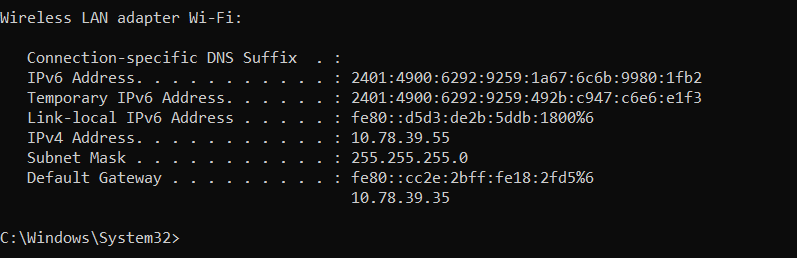

The key detail is its IPv4 address `10.78.39.55` and the gateway `10.78.39.35`.The Windows machine also shows IPv6 addresses (`2401:4900:6292:...`) — these are assigned by the ISP/router. 

---

#### Ubuntu Victim Network Config

On the **Ubuntu victim machine (10.78.39.240)**, run:

```bash
ifconfig
```


Here we can see that victim's ip address is `10.78.39.240`. The victim's MAC address is `08:00:27:14:9a:13` — this is what the real gateway uses to communicate with it.

---

#### Kali Attacker Network Config

On the **Kali Linux attacker machine (10.78.39.184)**, run:

```bash
ifconfig
```


Here we can see that victim's ip address is `10.78.39.184`. The attacker's MAC address is `08:00:27:b2:09:ce`. After the ARP spoofing attack starts, both the victim and the gateway will have their ARP caches poisoned to point to **this MAC address**, causing all traffic to flow through this machine.

---

### Switch to Root & Launch Bettercap

#### Why Root? 

Bettercap needs to send raw ARP packets and intercept network traffic at a very low level — things that only the `root` (superuser) account is allowed to do on Linux. Instead of using `sudo` before every command, we switched directly into the **root shell** first, so every command we type runs with full system privileges automatically.

#### Install Bettercap (if not already present):

```bash
sudo apt update
sudo apt install bettercap -y
```

#### Switch to Root Shell:

```bash
# From the normal 'vamsi' user account, switch to root:
sudo su
```

**What this does:** After running `sudo su`, your terminal prompt changes from `vamsi@kali` to `root@kali` — confirming you are now operating as the root user. 

#### Launch Bettercap (as root — no sudo needed):

Since we are already in the root shell, we just type:

```bash
bettercap
```
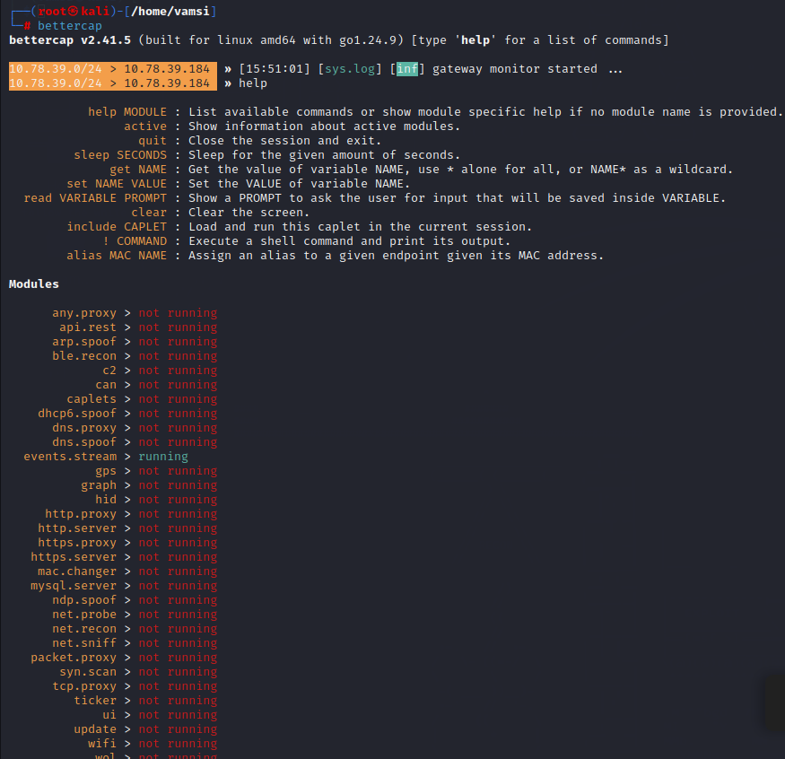
In this lab, `bettercap` was typed directly — **not** `sudo bettercap` — because we had already switched to the root user. Both achieve the same result, but switching to root first (`sudo su`) means you do not need to prefix every command with `sudo`.

Bettercap auto-detected the subnet (`10.78.39.0/24`) and identified the attacker's own IP (`10.78.39.184`). The gateway monitor started automatically — Bettercap is now watching the network and ready to attack.

---

#### Bettercap Help Menu

Inside the Bettercap console, typing `help` lists all available modules:

```
10.78.39.0/24 > 10.78.39.184 » help
```

The prompt `10.78.39.0/24 > 10.78.39.184` tells you Bettercap has identified the **subnet** (`10.78.39.0/24`) and the **attacker's IP** (`10.78.39.184`), and is ready to operate on that network segment.

---

### Discover Hosts with net.probe

#### net.probe Host Discovery

First, view the module help:

```
10.78.39.0/24 > 10.78.39.184 » help net.probe
```
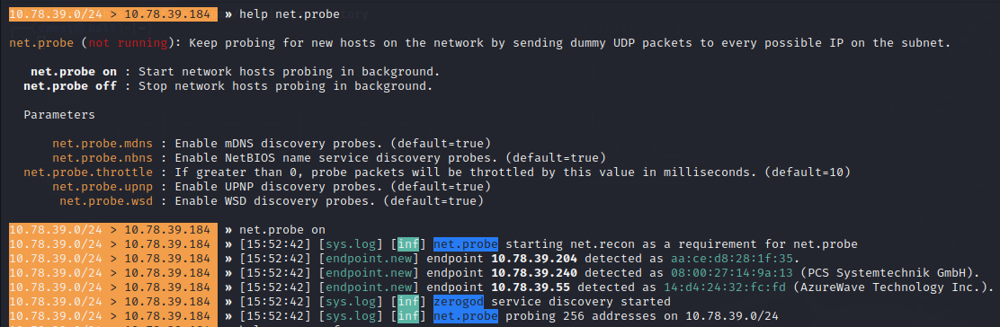
```
  net.probe on  : Start network hosts probing in background.
  net.probe off : Stop network hosts probing in background.
```

Now start probing:

```
10.78.39.0/24 > 10.78.39.184 » net.probe on
```

**What happened:** Bettercap sent UDP packets to all 256 possible IPs in the subnet and listened for ARP responses. It successfully identified:
- `10.78.39.240` → Ubuntu victim (MAC: `08:00:27:14:9a:13`, VirtualBox NIC vendor: PCS Systemtechnik GmbH)
- `10.78.39.55` → Windows/Splunk host (AzureWave = Wi-Fi adapter vendor)
- `10.78.39.204` → Another device on the network

This confirms the victim machine is live and reachable.

---

### Configure ARP Spoofing

#### ARP Spoof Configuration

View the arp.spoof module help:

```
10.78.39.0/24 > 10.78.39.184 » help arp.spoof
```
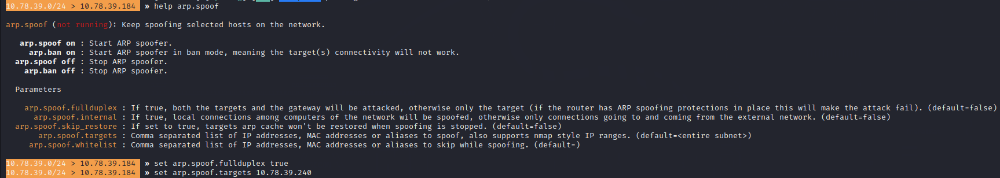

Now configure and start the attack:

```
10.78.39.0/24 > 10.78.39.184 » set arp.spoof.fullduplex true
10.78.39.0/24 > 10.78.39.184 » set arp.spoof.targets 10.78.39.240
```

**`fullduplex true` is critical:** With this setting, Bettercap poisons BOTH the victim's ARP cache (telling it the gateway's MAC is the attacker's MAC) AND the gateway's ARP cache (telling it the victim's MAC is the attacker's MAC). This ensures **bidirectional** traffic interception — both outgoing requests AND incoming responses pass through the attacker.

Without full duplex, only one direction is intercepted, and on routers with ARP spoofing protections, the attack may fail.

---

### Enable Packet Sniffing

#### ARP Spoof Started + net.sniff Enabled

```
10.78.39.0/24 > 10.78.39.184 » set net.sniff.local true
10.78.39.0/24 > 10.78.39.184 » arp.spoof on
```
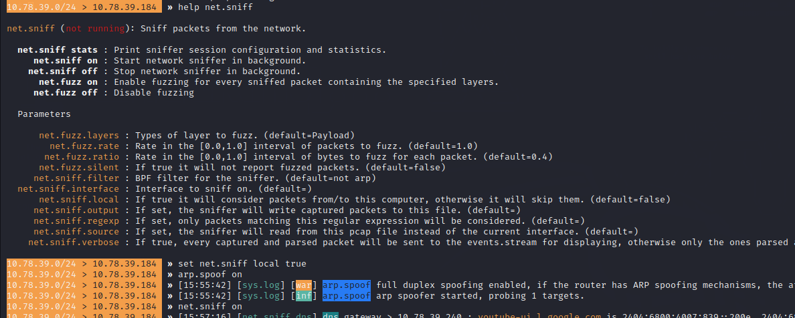

```
10.78.39.0/24 > 10.78.39.184 » net.sniff on
```

**`set net.sniff.local true`** — By default, Bettercap's sniffer ignores packets originating from or destined to the local machine. Setting `local true` ensures it captures **all traffic flowing through**, including the intercepted victim packets.
The **`[war]` warning** is Bettercap informing you that full-duplex spoofing (poisoning both sides) carries risk: if the router has ARP inspection/protection enabled, it may detect and block the forged replies, causing the attack to fail. In this process, no such protection was in place.

---

### Victim Browsing Activity

#### Victim Browsing Wikipedia, YouTube, Facebook
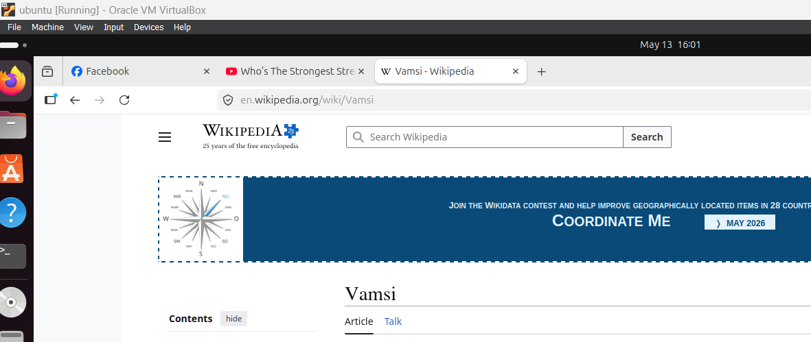

On the Ubuntu victim machine (running inside VirtualBox), the user opened **Firefox** and browsed to:
- `https://en.wikipedia.org/wiki/Vamsi`
- `https://www.youtube.com` (tab visible: "Who's The Strongest Stre…")
- `https://www.facebook.com`

**From the victim's perspective:** Everything works normally. Pages load, HTTPS connections are established, and there is no visible indication that all their DNS queries and connection metadata are being intercepted and logged in real-time by the attacker.

---

## Proof That ARP Spoofing is Successfully Working

This is the most important section — it shows **hard evidence** that the MITM attack succeeded. ARP spoofing is invisible to the victim, so how do we *know* it is working? Here are the concrete proofs :

---

### Bettercap Confirms "ARP Spoofer Started, Probing 1 Target" 

```
[15:55:42] [sys.log] [inf] arp.spoof arp spoofer started, probing 1 targets.
```

Bettercap printed this message the moment `arp.spoof on` was typed. "Probing 1 target" means it is actively sending **forged ARP reply packets** to the victim (`10.78.39.240`).

Both the victim and the gateway now believe the attacker is the person they should be talking to. All traffic is now flowing through the Kali machine.

---

### DNS Queries from Victim are Visible on Kali 

```
[15:57:16] [net.sniff.dns] dns gateway > 10.78.39.240 : youtube-ui.l.google.com is 
           2404:6800:4007:839::200e ...

[15:57:49] [net.sniff.dns] dns gateway > 10.78.39.240 : star-mini.c10r.facebook.com is 57.144.56.1

[16:00:30] [net.sniff.dns] dns gateway > 10.78.39.240 : upload.wikimedia.org is 103.102.166.240
```

These DNS responses were captured on the **Kali attacker machine** — not the victim machine. The victim's machine (`10.78.39.240`) sent DNS queries asking "What is the IP for youtube.com?", "What is the IP for facebook.com?", "What is the IP for upload.wikimedia.org?" — and **all the replies from the gateway passed through the attacker's machine first**. Bettercap logged every single one.

**This is the smoking gun.** If ARP spoofing had NOT worked, these DNS replies would go directly from the gateway to the victim — the Kali machine would see nothing. The fact that Kali is reading DNS responses meant for `10.78.39.240` **proves the MITM position is established**.

---

###  HTTPS Connections Are Visible via SNI

```
[15:10:32] [net.sniff.https] sni 10.78.39.240 > https://push.services.mozilla.com
[15:10:37] [net.sniff.https] sni 10.78.39.240 > https://incoming.telemetry.mozilla.org
[15:10:37] [net.sniff.https] sni 10.78.39.240 > https://normandy.cdn.mozilla.net
```

Even HTTPS (encrypted) traffic is partially exposed. Before the encryption starts, the victim's browser sends a **TLS ClientHello** message which includes the domain name in plain text — this is called the **Server Name Indication (SNI)**. Since ALL of the victim's traffic passes through the attacker's machine (because ARP spoofing worked), Bettercap reads this SNI field and logs which HTTPS servers the victim is connecting to.

**In plain English:** Imagine putting a sealed letter in an envelope, but the envelope has the destination address written on it. Even if you cannot open the letter (HTTPS encryption), you can read the address (SNI). ARP spoofing let the attacker read all those "envelopes."

---

### Plaintext HTTP Response Captured in Full 

```
[15:10:50] [net.sniff.http.response] http 34.107.221.82:80 200 OK → 10.78.39.240 (8 B text/plain)

HTTP/1.1 200 OK
Server: nginx
Via: 1.1 google
Content-Length: 8

success
```

 This HTTP response was sent from Google's server (`34.107.221.82`) back to the victim (`10.78.39.240`). The attacker's machine captured the **complete response including headers and body content** (`success`). The body is readable word for word.

**Why does this matter?** If the victim had submitted an HTTP login form (username + password), the attacker would have captured it completely. This HTTP capture proves the MITM is not just watching — it is reading real data flowing between the victim and the internet.

---

### ARP Spoofing Attack Flow (End-to-End)
BEFORE ATTACK:

```
  Ubuntu Victim (10.78.39.240)
      │  sends DNS query: "what is youtube.com?"
      ▼
  Gateway (10.78.39.35)
      │  replies directly to victim: "youtube.com = 142.251.x.x"
      ▼
  Ubuntu Victim receives answer — Kali sees NOTHING
```

AFTER ARP SPOOFING (MITM ACTIVE):
```
  Ubuntu Victim's ARP Cache says:
      "Gateway (10.78.39.35) = MAC 08:00:27:b2:09:ce"  ← ATTACKER'S MAC 

  Gateway's ARP Cache says:
      "Victim (10.78.39.240) = MAC 08:00:27:b2:09:ce"  ← ATTACKER'S MAC 

  Ubuntu Victim sends DNS query: "what is youtube.com?"
      │
      ▼
  Kali Attacker (10.78.39.184) ← INTERCEPTS IT FIRST
      │  reads the query, logs it, then forwards to real gateway
      ▼
  Gateway (10.78.39.35) sends reply: "youtube.com = 142.251.x.x"
      │
      ▼
  Kali Attacker ← INTERCEPTS THE REPLY TOO
      │  reads the response, logs it, then forwards to victim
      ▼
  Ubuntu Victim receives answer — never knows Kali read it 
```

**The victim's internet worked perfectly throughout** — YouTube loaded, Facebook opened, Wikipedia displayed. But **every single packet** they sent or received was read by the attacker. That is the power and danger of a successful ARP Spoofing / MITM attack.

---

### Detailed Capture Analysis: DNS, HTTPS & HTTP Traffic

#### HTTPS SNI and DNS Traffic Captured
Immediately after the victim started browsing, Bettercap's sniffer began capturing traffic:
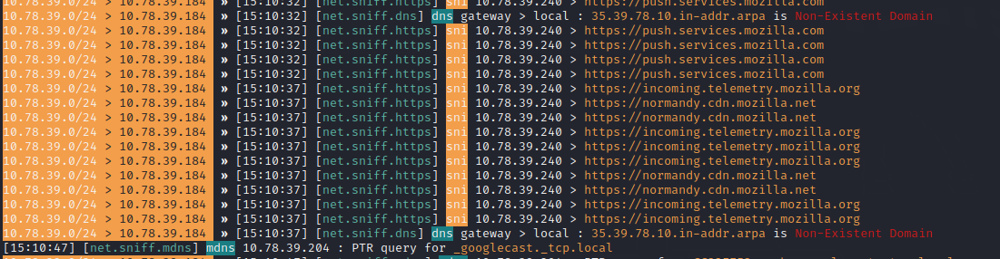


**HTTPS SNI exposure:** Even though the victim is using HTTPS, the **Server Name Indication (SNI)** field in the TLS handshake is sent in **plaintext** before encryption is established. This allows the MITM attacker to see exactly which HTTPS domains the victim is connecting to, without breaking encryption. This is a known privacy weakness of TLS 1.2 (TLS 1.3 with ECH/ESNI is designed to address this).

---

#### DNS Queries for YouTube and Facebook
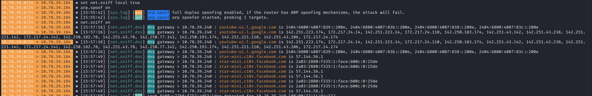

**This is the most powerful insight of a MITM attack.** Even though the victim is using HTTPS encrypted connections to YouTube and Facebook, their **DNS queries are fully visible** to the attacker:
- `youtube-ui.l.google.com` → multiple IPv6 addresses (CDN edge nodes)
 - `star-mini.c10r.facebook.com` → `57.144.56.1` (Facebook's infrastructure)

An attacker can build a complete **browsing profile** of the victim just from DNS queries, without needing to break any encryption. This is why **DNS over HTTPS (DoH)** and **DNS over TLS (DoT)** exist as privacy protections.

---

#### DNS for Wikipedia (upload.wikimedia.org)
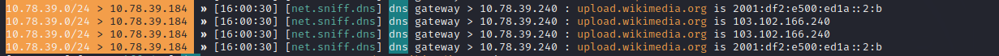

When the victim opened the Wikipedia article, the browser loaded resources from `upload.wikimedia.org` (for images/media). The attacker captured the DNS resolution of this domain to Wikimedia's CDN IP (`103.102.166.240`). This confirms the victim visited Wikipedia — all from DNS alone.

---

#### HTTP Response Captured
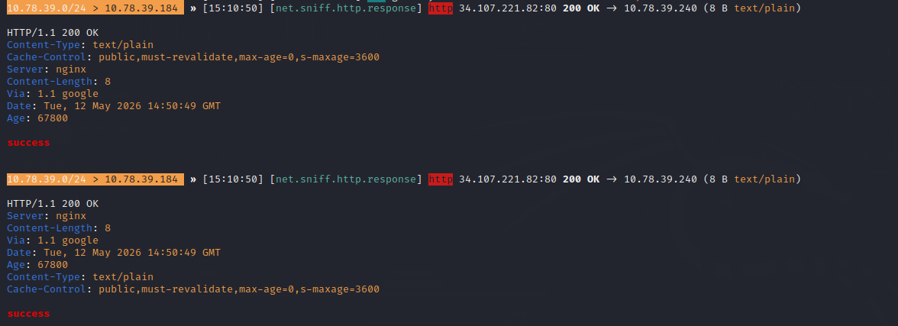

**Plaintext HTTP traffic is fully exposed.** This HTTP response from `34.107.221.82:80` (a Google-served server via nginx) returned the body `success` — completely readable by the attacker. Unlike HTTPS, HTTP has **zero encryption** and everything including headers, cookies, form data, and responses are intercepted in their entirety.

Note that `Via: 1.1 google` suggests this is a Google connectivity check endpoint — the victim's browser periodically pings these to verify internet connectivity.

---

## Splunk Enterprise — Log Monitoring & Detection

Splunk Enterprise (`10.78.39.55`) was configured to receive logs from the Ubuntu victim machine (`10.78.39.240`) via a **Universal Forwarder**. This simulates a real enterprise SOC (Security Operations Center) setup.

---

#### Splunk Main Index Overview

**Search Query:**
```spl
index="main"
```
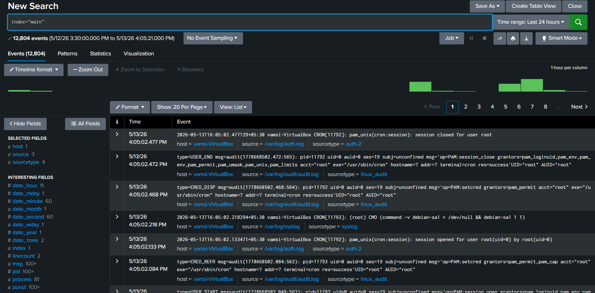

**Result:** `12,804 events` from `5/12/26 3:30:00 PM to 5/13/26 4:05:21 PM`

This view shows the baseline of all activity collected. The 12,804 events include normal system operations, cron jobs, authentication, and the attack-induced network activity. The timeline shows two bursts of elevated activity — correlating with when the MITM attack was active.

---

#### Victim IP Activity in Splunk

**Search Query:**
```spl
10.78.39.240
```
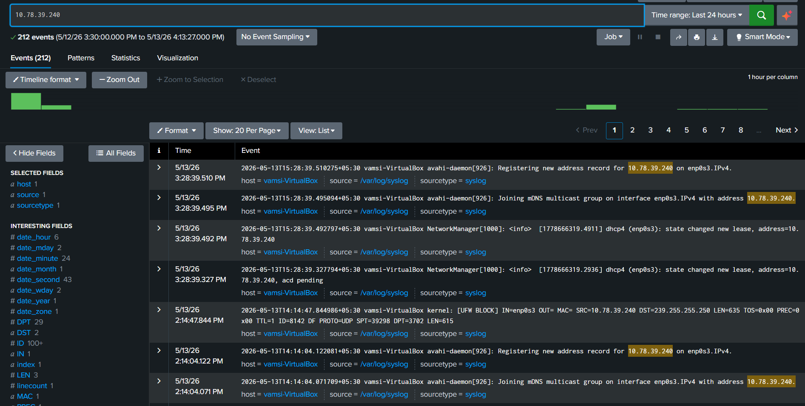

**Result:** `212 events` from `5/12/26 3:30:00 PM to 5/13/26 4:13:27 PM`

**Notable events:**
```
5/13/26 3:28:39 PM  avahi-daemon[926]: Registering new address record for 10.78.39.240 on enp0s3.IPv4
5/13/26 3:28:39 PM  NetworkManager[1000]: dhcp4 (enp0s3): state changed new lease, address=10.78.39.240
5/13/26 2:14:47 PM  kernel: [UFW BLOCK] IN=enp0s3 OUT= SRC=10.78.39.240 DST=239.255.255.250 PROTO=UDP
```

**What these logs tell us:**
- `avahi-daemon` registered `10.78.39.240` on the network interface — normal mDNS/Avahi registration when the network came up
- `NetworkManager` confirmed a new DHCP lease at `10.78.39.240` — the victim machine obtained its IP
- **UFW BLOCK** entry: The victim's firewall blocked a UDP multicast packet to `239.255.255.250` (SSDP/UPnP discovery) — shows the victim's firewall is active
- The 212 events provide a complete picture of the victim machine's network behavior during the attack window

---

#### Root User Activity in Splunk

**Search Query:**
```spl
root
```
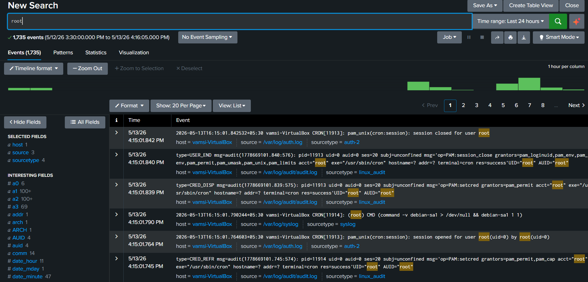

**Result:** `1,735 events`

 **Why "root" shows 1,735 events:** The attack was launched from **Kali Linux running as `root`** user. The Ubuntu victim machine logs show cron jobs and system processes running as `root` (which is normal). In Splunk, all these log entries contain the keyword "root" — including routine cron jobs, PAM authentication events, and audit records.

**From a defender's perspective:** Splunk's ability to search for `root` across all log sources simultaneously reveals every privileged action taken during the monitoring window. Unusual `root` activity (e.g., unexpected shell executions or privilege escalations) would stand out immediately against the baseline of normal cron entries.

The audit log entries (`type=CRED_DISP`, `type=USER_END`, `type=CRED_REFR`) are **Linux audit framework** records tracking PAM (Pluggable Authentication Module) credential operations — showing the complete lifecycle of every session opened as root.

---

#### DNS Events in Splunk

**Search Query:**
```spl
dns
```
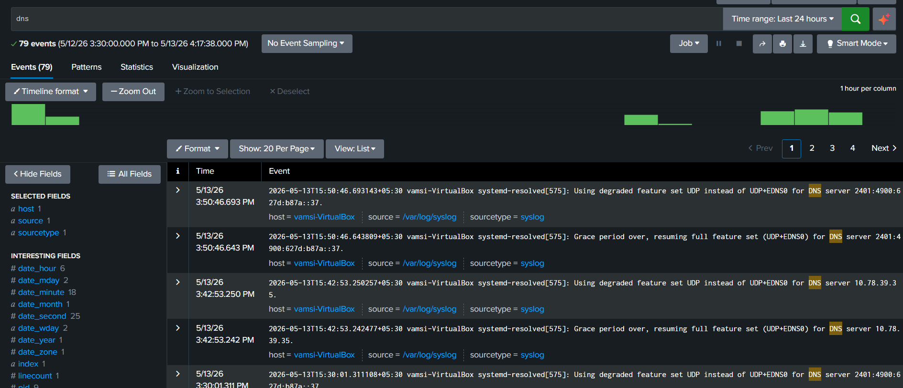

**Result:** `79 events`


**Key insight — DNS degradation events:** The `systemd-resolved` entries showing **"Using degraded feature set UDP instead of UDP+EDNS0"** are a crucial ARP spoofing indicator. When the MITM attack intercepts DNS traffic, the DNS server's extended features (EDNS0) may not function correctly through the attacker's relay, causing the resolver to fall back to basic UDP mode.

 The **"Grace period over, resuming full feature set"** message shows DNS recovering after the EDNS0 downgrade — this cycling between degraded and normal DNS operation is a **behavioral anomaly** detectable in SIEM logs.

The switch between the ISP's IPv6 DNS server (`2401:4900:...`) and the gateway (`10.78.39.35`) as the resolver further reflects the DNS configuration instability caused by the MITM interception.

## DNS Monitoring — Why DNS Matters in MITM

DNS (Domain Name System) is often called the **"phonebook of the internet."** When a user types `www.youtube.com`, their computer first asks a DNS server to translate that name into an IP address. This query travels over **UDP port 53** in **plain text** by default.

In a MITM attack:

```
Normal DNS flow:
  Victim → DNS Query (plaintext) → DNS Server → IP Address returned

MITM DNS interception:
  Victim → DNS Query → [ATTACKER SEES IT] → DNS Server → IP Address → [ATTACKER SEES IT] → Victim
```

**What the attacker learns from DNS:**
- Every website the victim visits (even HTTPS sites)
- Approximate timestamps of browsing activity
- Background app activity (telemetry, push notifications, updates)
- Device fingerprinting via mDNS queries

**DNS also reveals system behavior:**
```
[net.sniff.mdns] mdns 10.78.39.204 : PTR query for _googlecast._tcp.local
```
This mDNS query (Screenshot 9) reveals a **Chromecast device** on the network searching for Google Cast services.

**The connection between ARP and DNS in this attack:**
ARP spoofing is the **delivery mechanism** — it positions the attacker in the middle. Once in position, DNS becomes the **intelligence source** — revealing all of the victim's internet activity without breaking any encryption.


---

#### Splunk Captures Attacker IP + Both MACs in Victim's Firewall Logs

**Search Query:**
```spl
10.78.39.184
```
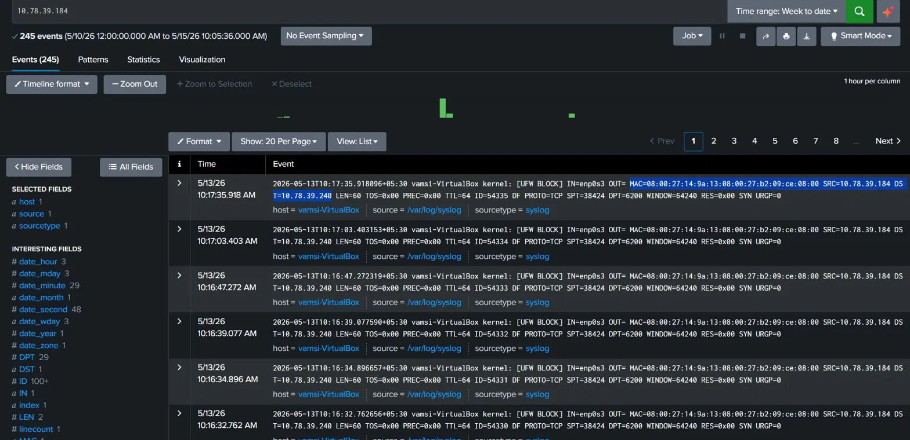

**Result:** `245 events` | Time range: **Week to date** (`5/10/26 12:00:00 AM to 5/15/26 10:05:36 AM`)

**Log Source:** `/var/log/syslog` on `vamsi-VirtualBox` (the **victim's Ubuntu machine**) | sourcetype: `syslog`

When Splunk searched for the attacker's IP (10.78.39.184), it found 245 events . Those events came from the victim's own machine (vamsi-VirtualBox). The victim's Ubuntu firewall (UFW) was silently logging every time the Kali attacker machine sent packets at it.


---

### Breaking Down the UFW Log — What Every Field Means

This single log entry tells the full story of the attack. Here is what each field means in plain English:

| Field | Value | What It Means |
|---|---|---|
| `[UFW BLOCK]` | — | Ubuntu's firewall **blocked** this packet — it did not let it through |
| `IN=enp0s3` | `enp0s3` | The packet **arrived on** the victim's network interface (ethernet card) |
| `OUT=` | *(empty)* | The packet was **not forwarded** anywhere — it was stopped at this machine |
| `MAC=08:00:27:14:9a:13` | Victim's MAC | **Destination MAC** — the packet was addressed TO the victim's physical address |
| `:08:00:27:b2:09:ce` | Attacker's MAC | **Source MAC** — the packet was sent FROM the Kali attacker's physical address |
| `:08:00` | `0x0800` | **EtherType** — tells the network this is an IPv4 packet |
| `SRC=10.78.39.184` | Attacker IP | The packet's **source IP** is the Kali attacker machine |
| `DST=10.78.39.240` | Victim IP | The packet's **destination IP** is this Ubuntu victim machine |
| `PROTO=TCP` | TCP | Protocol used — **Transmission Control Protocol** |
| `SPT=38424` | Port 38424 | **Source port** on the attacker's side (random high port used by Bettercap) |
| `DPT=6200` | Port 6200 | **Destination port** being targeted on the victim (a port used during network probing) |
| `SYN` | TCP flag | This is a **TCP handshake initiation** packet — the attacker was trying to open a connection |
| `URGP=0` | 0 | No urgent data — standard packet |

---

## Security Risks of ARP Spoofing

| Risk | Description | Severity |
|---|---|---|
| **Credential Theft** | HTTP login forms captured in plaintext | Critical |
| **Session Hijacking** | HTTP session cookies intercepted and replayed | Critical |
| **SSL Stripping** | HTTPS downgraded to HTTP via tools like sslstrip | Critical |
| **DNS Poisoning** | DNS responses modified to redirect victim to fake sites | Critical |
| **Browsing Profile** | Complete surveillance of which sites victim visits | High |
| **Data Exfiltration** | Sensitive data in transit captured and exfiltrated | Critical |
| **Malware Injection** | Malicious content injected into HTTP responses | Critical |
| **VoIP Eavesdropping** | Unencrypted VoIP calls intercepted | High |

---
