## FTP Brute Force Attack

This lab simulates a real-world **FTP Brute Force Attack** scenario in a controlled virtual environment. An attacker machine (Kali Linux) launches a credential stuffing attack against a victim FTP server (Ubuntu running VSFTPD) using **Hydra**, one of the most widely used online password-cracking tools. Meanwhile, the victim machine's authentication and FTP logs are shipped to a **Splunk Enterprise SIEM** using the **Splunk Universal Forwarder**, where security analysts can detect, monitor, and investigate the attack.

This lab covers the full attack lifecycle — from setting up the FTP server, through launching the brute force, all the way to detecting suspicious activity in Splunk — giving hands-on experience in both offensive and defensive cybersecurity.

---

## Lab Environment

| Machine            | Role                       | IP Address       |
|--------------------|----------------------------|------------------|
| **Kali Linux**     | Attacker Machine           |  192.168.56.103   |
| **Ubuntu VM**      | Victim           | 192.168.56.104   |
| **Splunk Server**  | SIEM Monitoring Server     |  192.168.56.1  |

All machines are connected via a **Host-Only Adapter** in VirtualBox, creating an isolated internal network. This ensures no traffic leaves the lab environment.

---

## Step 1 – Installing VSFTPD on Ubuntu

### What is VSFTPD?

**VSFTPD (Very Secure FTP Daemon)** is a lightweight, fast, and secure FTP server for Unix-like systems. It is the most widely used FTP server on Linux and is known for its strong security features, good performance, and easy configuration. In this lab, VSFTPD acts as the **target FTP service** that the attacker will attempt to brute force.

### Command Used

```bash
sudo apt update
sudo apt install vsftpd -y
```

The `sudo apt update` command refreshes the package index, ensuring that the latest version of VSFTPD is available for installation. The `sudo apt install vsftpd -y` command then installs the package with the `-y` flag automatically confirming the installation prompt.

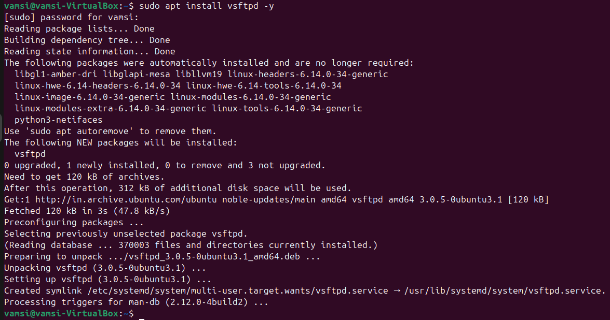

After this step, VSFTPD is installed but not yet active or configured for our use case. The next steps handle enabling and starting the service.

---

## Step 2 – Enabling and Starting VSFTPD Service

### Commands Used

```bash
sudo systemctl enable vsftpd
sudo systemctl start vsftpd
```

The `systemctl enable vsftpd` command configures VSFTPD to **start automatically at system boot** by creating a symlink in the systemd init system. The `systemctl start vsftpd` command immediately starts the VSFTPD daemon in the current session without requiring a reboot.


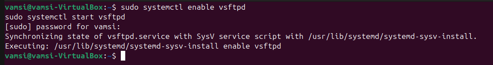

To verify the service is running, use `sudo systemctl status vsftpd`. A `active (running)` status in green confirms the service is healthy.

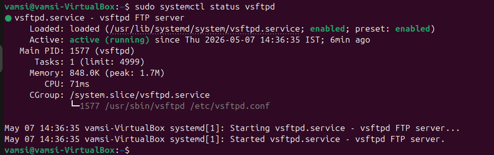

---

## Step 3 – Verifying VSFTPD is Listening on Port 21

### Command Used

```bash
sudo netstat -tulnp | grep 21
```

This command uses `netstat` to display all active network connections and listening ports (`-tulnp` = TCP, UDP, Listening, Numeric, Process). The output is filtered using `grep 21` to isolate the FTP port (port 21).


The output confirms:

```
tcp6    0    0 :::21    :::*    LISTEN    1577/vsftpd
```

- **Protocol:** `tcp6` — VSFTPD is listening on IPv6 (which also covers IPv4 connections through dual-stack)
- **Local Address:** `:::21` — The `:::` means it is listening on **all network interfaces** on port 21
- **State:** `LISTEN` — The service is actively waiting for incoming connections
- **PID/Program:** `1577/vsftpd` — Process ID 1577 is the running vsftpd daemon

This confirms that the FTP server is **up and running** and ready to accept connections on port 21.

---

## Step 4 – Checking UFW Firewall Status

### Command Used

```bash
sudo ufw status
```

**UFW (Uncomplicated Firewall)** is Ubuntu's default host-based firewall. Before allowing FTP connections, we check its current status and rules.

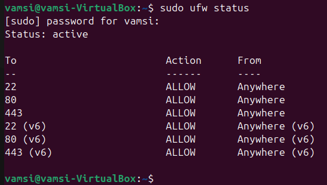

The output shows:
- **Status: active** — The firewall is enabled and enforcing rules.
- Currently, the following ports are allowed:
  - **Port 22** (SSH) — Allows remote access
  - **Port 80** (HTTP) — Allows web traffic
  - **Port 443** (HTTPS) — Allows secure web traffic
- The same rules are applied for **IPv6** as well (denoted by the `(v6)` suffix).

**Important:** Notice that **port 21 (FTP) is NOT listed**. This means any FTP connection attempt from Kali will be **blocked by the firewall** at this stage. We must add a UFW rule to allow FTP before the attack can work.

---

## Step 5 – Allowing FTP Port 21 Through the Firewall

### Command Used

```bash
sudo ufw allow 21/tcp
```

This command creates a UFW rule that permits incoming **TCP connections on port 21**, which is the standard FTP control port. Without this rule, the firewall would silently drop all connection attempts from Kali to the FTP server.


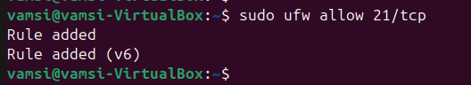

The output shows:
```
Rule added
Rule added (v6)
```

- **`Rule added`** — The IPv4 rule for TCP port 21 has been successfully added.
- **`Rule added (v6)`** — The corresponding IPv6 rule has also been added automatically.

UFW automatically adds both IPv4 and IPv6 rules simultaneously, ensuring the FTP service is accessible regardless of which IP version the client uses.

---

## Step 6 – Verifying Firewall Rule for Port 21

### Command Used

```bash
sudo ufw status
```

After adding the port 21 rule, we verify the updated firewall configuration.

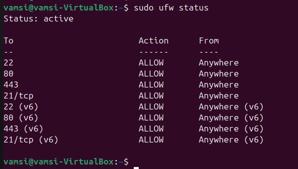

The updated firewall rules now show:


The **21/tcp** rule is now visible in both IPv4 and IPv6 rulesets. The Ubuntu FTP server is now fully accessible from any machine on the network, including our Kali attacker machine. The lab environment is now ready for connectivity testing.

---

## Step 7 – Testing FTP Login from Kali Linux

### Command Used

```bash
ftp 192.168.56.104
```

Before launching the brute force attack, we verify that legitimate FTP access works correctly by manually connecting to the Ubuntu FTP server using the existing user `vamsi`.Here we are testing whether attacker can get FTP login if he had password.So,we are getted login with `known password` of the victim where later the password will be identified by hydra.

### Login Credentials

```
Username: vamsi
Password: kali
```

The user `vamsi` already exists on the Ubuntu machine. In this lab, the password used for this user is `kali`, which is included in the wordlist that Hydra will later use.


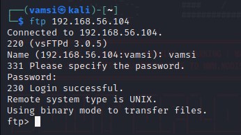

Breaking this down line by line:
- **`Connected to 192.168.56.104`** — TCP connection was successfully established
- **`220 (vsFTPd 3.0.5)`** — The server responded with its FTP banner, revealing it is running **vsFTPd version 3.0.5** (this information is valuable to an attacker)
- **`331 Please specify the password`** — Server accepted the username and is requesting a password
- **`230 Login successful`** — Authentication succeeded
- **`Remote system type is UNIX`** — The server is a UNIX-based system (further information disclosure)
- **`Using binary mode to transfer files`** — FTP is in binary mode, which ensures accurate transfer of non-text files
- **`ftp>`** — We are now at an interactive FTP command prompt, ready to issue commands

This confirms end-to-end connectivity and valid credentials. The FTP server is working as expected.

---

## Step 8 – Monitoring Authentication Logs on Ubuntu

### Command Used

```bash
sudo tail -f /var/log/auth.log
```

The `/var/log/auth.log` file records all **authentication-related events** on the Ubuntu system, including logins, sudo commands, SSH sessions, and PAM (Pluggable Authentication Modules) events. The `tail -f` flag follows the log in real time — any new entries are displayed as they are written.

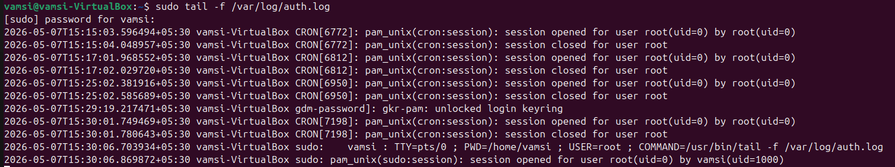

---

## Step 9 – Creating a Password Wordlist on Kali Linux 

### Commands Used

```bash
nano passwords.txt
cat passwords.txt
```

A **wordlist** (also called a dictionary file) is a plain text file containing a list of potential passwords that Hydra will try one by one against the FTP target. Creating a targeted wordlist that includes the victim's actual password simulates a real-world **dictionary attack**.


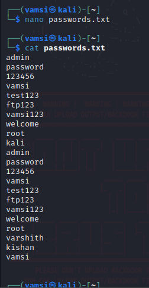

Key observations about this wordlist in `password.txt` file:
- The actual password (`kali`) is present in the list, ensuring Hydra will eventually find it.
This demonstrates why using **common, guessable passwords** is dangerous. Even a small wordlist like this one can crack weak passwords in seconds.

---

## Step 10 – Performing the FTP Brute Force Attack with Hydra

### What is Hydra?

**Hydra** (also known as THC-Hydra) is a fast and flexible **online password cracking tool** that supports numerous protocols including FTP, SSH, HTTP, Telnet, SMTP, and many more. It works by attempting login credentials from a wordlist against a target service in rapid succession.

### Command Used

```bash
hydra -l vamsi -P passwords.txt ftp://192.168.56.104
```

**Flag Explanation:**

| Flag | Description |
|------|-------------|
| `-l vamsi` | Specifies a **single username** to attack. The lowercase `-l` means one specific username. |
| `-P passwords.txt` | Specifies the **password wordlist** file. Uppercase `-P` means a file of multiple passwords. |
| `ftp://192.168.56.104` | The **target service and IP**. Hydra identifies the protocol (FTP) and directs the attack to the specified host. |


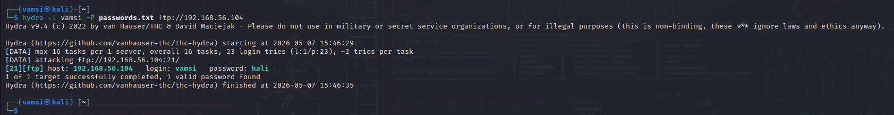

Breaking down this output:
- **`max 16 tasks per 1 server`** — Hydra spawned 16 parallel threads to speed up the attack
- **`23 login tries (l:1/p:23)`** — 1 username × 23 passwords = 23 total attempts
- **`~2 tries per task`** — Load was distributed approximately evenly across threads
- **`[21][ftp] host: 192.168.56.104 login: vamsi password: kali`** — **CRACKED!** The password for user `vamsi` is `kali`
- **`1 of 1 target successfully completed, 1 valid password found`** — Attack was successful
- **Total time: 6 seconds** (from 15:46:29 to 15:46:35) — The attack completed in just **6 seconds**.

---

## Step 11 – Logging in with the Cracked Credentials

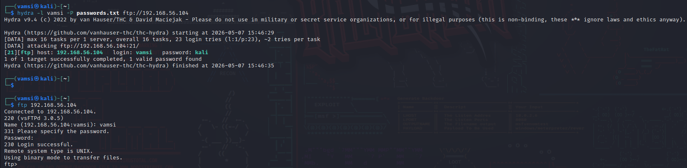

This screenshot shows two key events:

**Top section — Hydra output (same as Step 10):**  
Confirms the cracked credentials: `login: vamsi | password: kali`

**Bottom section — FTP Login using cracked credentials:**

```bash
ftp 192.168.56.104
```

After Hydra successfully identified the correct password (`kali`), the attacker immediately uses the cracked credentials to **manually log in** to the FTP server. The `230 Login successful` response confirms that the attacker now has full FTP access to the victim machine.

This is the **post-exploitation phase** — the attacker has moved from credential cracking to active access. From here, they can list files, download sensitive data, or upload malicious files.

---

## Step 12 – Listing Files on the FTP Server

### Command Used

```ftp
ls
```

Once logged into the FTP server, the `ls` command lists all files and directories in the current directory (which defaults to the user `vamsi`'s home directory).


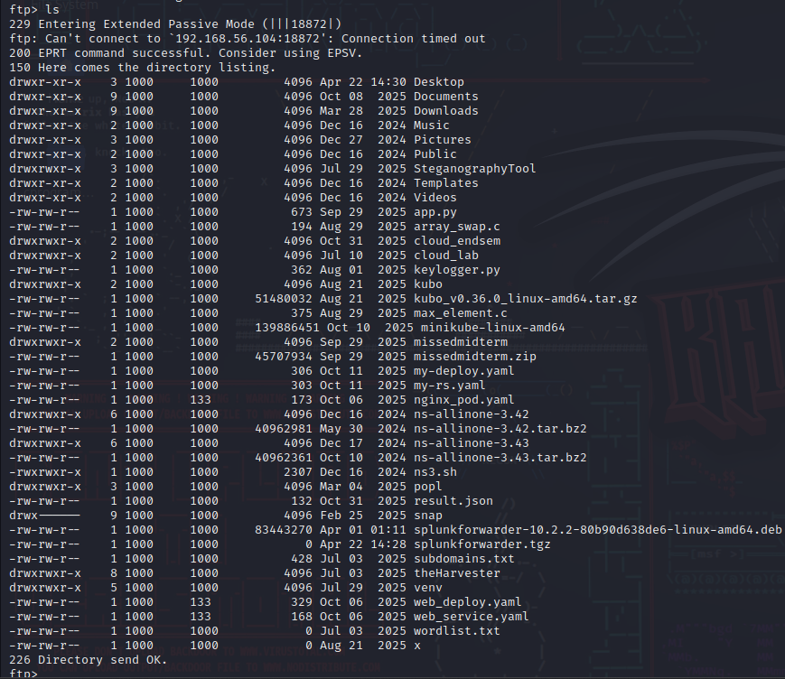

The FTP session shows a connection issue with **Extended Passive Mode (EPSV)** before falling back to **EPRT** mode successfully. This is a common occurrence in NAT or VirtualBox network environments where passive mode data channels cannot be directly established, but the fallback still allows the listing to proceed.

The directory listing reveals the full contents of the victim user's home directory .Here we can see that attacker is able to list the files of the victim.
---

## Step 13 – Downloading a File via FTP (GET)

### Command Used

```ftp
get wordlist.txt
```

The `get` command in FTP downloads (retrieves) a specified file from the **remote server** to the **local machine** (Kali). Here, the attacker downloads `wordlist.txt` from the victim's home directory.


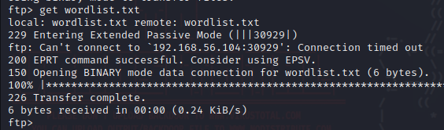

---

## Step 14 – Confirming Downloaded File on Kali

### Command Used

```bash
ls
```

After the FTP `get` operation, we verify the downloaded file now exists on the Kali attacker machine.

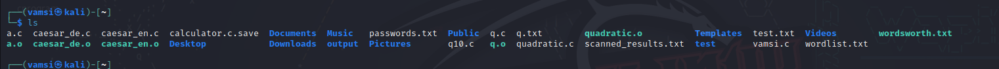

The `ls` output on Kali shows the home directory contents. Notice the presence of:
- **`wordlist.txt`** — successfully downloaded from the victim FTP server

The presence of `wordlist.txt` confirms that the **GET operation was successful** and the file has been exfiltrated from the victim's machine to the attacker's machine.

---

## Step 15 – Creating a File for Upload on Kali

### Commands Used

```bash
nano vamsi_ftp.txt
ls
```

To demonstrate **file upload (PUT)** via FTP, we first create a new file on the Kali attacker machine. This simulates a scenario where an attacker uploads a malicious file (such as a backdoor, web shell, or malware) to the victim server.


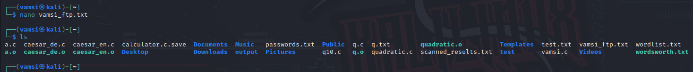
1. **`nano vamsi_ftp.txt`** — the nano text editor was opened to create a new file named `vamsi_ftp.txt`. Content was added and saved.
2. **`ls`** output — the directory listing now includes **`vamsi_ftp.txt`**, confirming the file was created successfully.

---

## Step 16 – Uploading a File via FTP (PUT)

### Command Used

```ftp
put vamsi_ftp.txt
```

The `put` command in FTP uploads (sends) a file from the **local machine** (Kali) to the **remote FTP server** (Ubuntu).

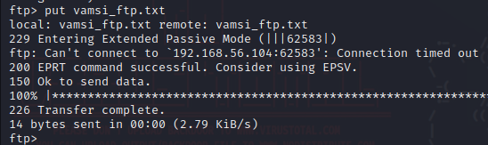

---

## Step 17 – Confirming Uploaded File on Ubuntu Server

### Command Used

```bash
ls
```

Back on the Ubuntu victim machine, we verify that the file uploaded from Kali attacker machine is now present in the victim's home directory.

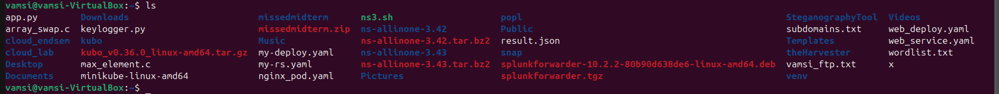

The `ls` output on the Ubuntu machine shows the home directory of the user `vamsi`. Highlighted in the listing is **`vamsi_ftp.txt`** — the file that was just uploaded from the Kali attacker machine via FTP.

---

## Step 18 – Viewing Brute Force Evidence in auth.log

### Command Used

```bash
sudo tail -f /var/log/auth.log
```

After the Hydra brute force attack, we re-examine the Ubuntu authentication log to observe the evidence left behind by the attack.

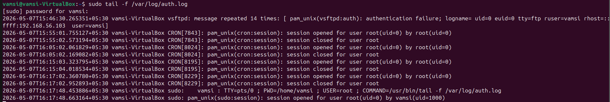

This is the most critical log evidence screenshot in the entire lab. The first log entry reads:

```
2026-05-07T15:30.265351+05:30 vamsi-VirtualBox vsftpd: message repeated 14 times:
[ pam_unix(vsftpd:auth): authentication failure; logname= uid=0 euid=0
tty=ftp ruser=vamsi rhost=::ffff:192.168.56.103 user=vamsi ]
```

**This single log entry is the smoking gun of the brute force attack.** Here's what it tells us:

- **`vsftpd`** — the event was generated by the FTP daemon
- **`message repeated 14 times`** — this single line summarizes **14 consecutive authentication failures**, which is the system's way of compressing repeated identical log entries. This is a direct result of Hydra's rapid-fire password attempts.
- **`pam_unix(vsftpd:auth): authentication failure`** — PAM (Pluggable Authentication Module) rejected the authentication attempt
- **`uid=0 euid=0`** — the FTP daemon process was running as root-equivalent
- **`tty=ftp`** — the terminal type is FTP (not a real terminal, confirming it's a programmatic login attempt)
- **`ruser=vamsi`** — the remote username attempting to log in
- **`rhost=::ffff:192.168.56.103`** — the **attacker's IP address** (192.168.56.103 in IPv4-mapped IPv6 format) — this is critical forensic evidence
- **`user=vamsi`** — the local username being targeted

The subsequent entries show normal CRON activity, confirming that the brute force messages stand out dramatically against the baseline noise.

**Detection Rule:** In a SOC environment, a rule that triggers on **more than 5 `authentication failure` events from the same source IP within 1 minute** would catch this attack in near real-time.

---

## Step 19 – Viewing Events in Splunk Enterprise

### Splunk Search Used

```spl
index="main"
```

After the Splunk Universal Forwarder was configured to ship `/var/log/auth.log` and `/var/log/vsftpd.log` to the Splunk server, we can search and analyze all forwarded events.

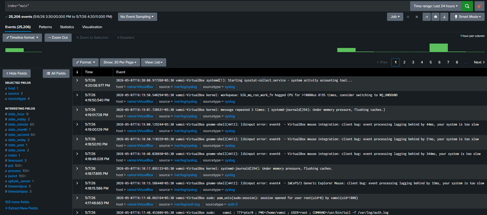

The Splunk search interface shows :

**Event Count:**  
- **25,206 events** were ingested from the Ubuntu machine over the time range **5/6/26 3:30:00 PM to 5/7/26 4:20:11 PM** (approximately 25 hours of logs).

**Selected Fields (Left Panel):**
- `host` — 1 unique host (`vamsi-VirtualBox`)
- `source` — 3 unique sources (auth.log, vsftpd.log, syslog)
- `sourcetype` — 4 unique sourcetypes

**SIEM Value:** Having all logs centralized in Splunk allows security teams to correlate events from multiple sources, build dashboards, set up alerts, and conduct forensic investigations from a single pane of glass.

---
## Step 20 – Searching VSFTPD Events in Splunk
 
### Splunk Search Used
 
```spl
index=* vsftpd
```
 
This SPL (Search Processing Language) query searches **all indexes** for any log event that contains the keyword `vsftpd`. 

 
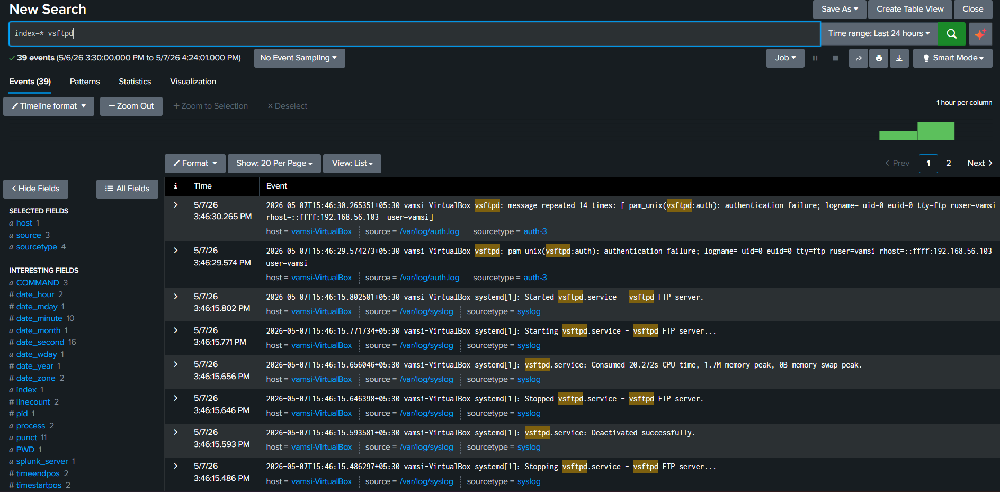
 
**Search Statistics:**
- **39 events** matched the query `index=* vsftpd` over the time range **5/6/26 3:30:00 PM to 5/7/26 4:24:01 PM**
 
**Key Forensic Fields Visible in Each Event:**
- **`host = vamsi-VirtualBox`** — identifies the victim machine
- **`source = /var/log/auth.log`** — confirms this is from the authentication log
- **`sourcetype = auth-3`** — Splunk's automatic sourcetype classification for Linux auth logs
- **`rhost=::ffff:192.168.56.103`** — the attacker's IP address embedded in the raw event
 
---
 
## Step 21 – Searching All FTP-Related Events in Splunk
 
### Splunk Search Used
 
```spl
index=* ftp
```
 
This query broadens the search scope by looking for the keyword `ftp` (case-insensitive) across all indexes, rather than specifically `vsftpd`. The term `ftp` appears in a wider variety of log entries  including systemd service descriptions (`vsftpd FTP server`).
 
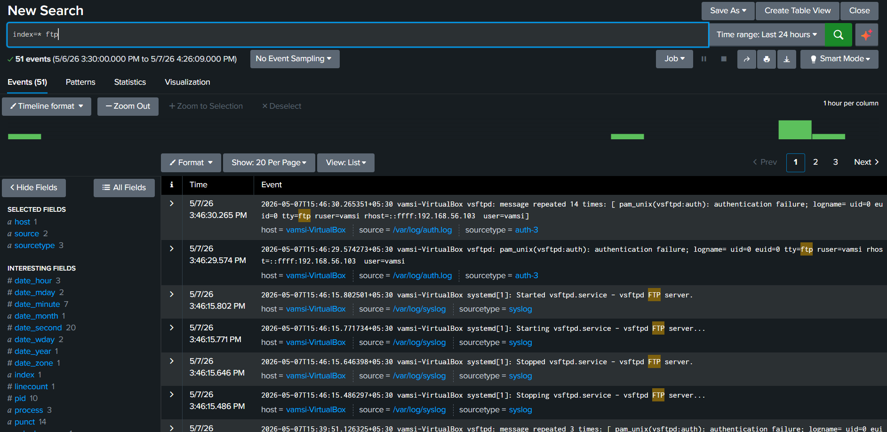
 
**Search Statistics:**
- **51 events** matched the query `index=* ftp` over the time range **5/6/26 3:30:00 PM to 5/7/26 4:26:09 PM**
- This is **12 more events** than the `vsftpd` query returned (39 events), because the broader `ftp` keyword catches additional entries that mention "FTP" in service description text (e.g., `vsftpd FTP server`) even when the word `vsftpd` alone would already match them — and additionally catches entries like `tty=ftp` in PAM auth records.

---

