# Nmap SYN Port Scan
## Introduction

### What is an Nmap SYN Scan?

An **Nmap SYN Scan** (also known as a **Half-Open Scan** or **Stealth Scan**) is one of the most popular and widely used port scanning techniques in network reconnaissance. When an attacker runs `nmap -sS`, the tool sends TCP SYN packets to the target machine on various ports:

- If the port is **open**, the target responds with a **SYN-ACK** packet.
- The attacker then immediately sends a **RST (Reset)** packet instead of completing the three-way handshake.
- If the port is **closed**, the target responds with a **RST** packet.

Because the TCP handshake is never completed, this scan is considered "stealthy" — it may evade older intrusion detection systems. However, modern SIEM solutions like Splunk can detect this activity through kernel-level firewall logs.

### What is Splunk Enterprise?

**Splunk Enterprise** is a powerful Security Information and Event Management (SIEM) platform that collects, indexes, and correlates machine-generated data from various sources in real time. It provides a web-based interface for searching, monitoring, and analyzing log data, making it an industry-standard tool for threat detection and incident response.
### What is Splunk Forwarder?
**Splunk Universal Forwarder** is a lightweight log collection agent installed on endpoint systems to collect and forward machine data to Splunk Enterprise for centralized monitoring and analysis. In this project, Splunk Universal Forwarder was installed on the Ubuntu victim machine to monitor system log files and securely send the generated logs to the Splunk Enterprise server running on Windows. It plays a crucial role in real-time log forwarding and enables continuous security event monitoring within the SIEM environment.


### Why is SIEM Monitoring Important?

In modern cybersecurity, attackers often perform reconnaissance silently before launching a full-scale attack. **SIEM monitoring is critical because:**

- It provides **real-time visibility** into network traffic and system events.
- It enables **early detection** of scanning, brute-force, and lateral movement activities.
- It creates an **audit trail** that supports forensic investigation.
- It allows security analysts to **correlate events** across multiple machines.

Without a SIEM, an Nmap SYN scan against your network could go completely unnoticed.

---

## Architecture Overview

### Lab Environment

| Role | Operating System | IP Address |
|------|-----------------|------------|
| 🔴 Attacker | Kali Linux | `192.168.56.103` |
| 🟡 Victim / Log Source | Ubuntu (with Splunk Universal Forwarder) | `192.168.56.104` |
| 🟢 SIEM Server | Windows (Splunk Enterprise) | `192.168.56.1` |

---

### Log Flow Diagram

```
┌─────────────────────┐        SYN Packets        ┌──────────────────────────┐
│   Kali Linux        │ ────────────────────────► │   Ubuntu (Victim)        │
│   (Attacker)        │                            │   192.168.56.104         │
│   192.168.56.103    │                            │                          │
└─────────────────────┘                            │  Kernel logs SYN packets │
                                                   │  into /var/log/syslog    │
                                                   │                          │
                                                   │  ┌────────────────────┐  │
                                                   │  │ Splunk Universal   │  │
                                                   │  │ Forwarder          │  │
                                                   │  │ Monitors syslog    │  │
                                                   │  └────────┬───────────┘  │
                                                   └───────────┼──────────────┘
                                                               │
                                                               │ TCP Port 9997
                                                               ▼
                                                   ┌──────────────────────────┐
                                                   │   Windows Host           │
                                                   │   Splunk Enterprise      │
                                                   │   192.168.56.1           │
                                                   │   Indexes & Analyzes     │
                                                   │   incoming log data      │
                                                   └──────────────────────────┘
```


---

## Step 1 — Verifying IP Addresses
Before any attack or detection work begins, the IP address of each machine must be confirmed. All three machines must be on the same **Host-Only network** (`192.168.56.0/24`) in VirtualBox to communicate with each other.


### Kali Linux — `ip a`
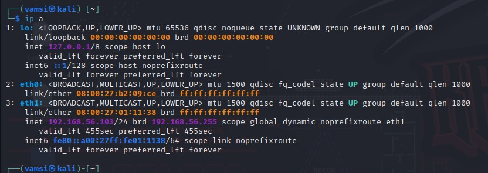

`ip a` (short for `ip address`) displays all network interfaces and their assigned IP addresses on the system. In Kali Linux, this is used to confirm which interface is connected to the lab's Host-Only network so we know the attacker's IP before launching the scan.

```bash
ip a
```

The output confirmed that the **eth1** interface was assigned the IP address `192.168.56.103` on the Host-Only network.

---

### Ubuntu — `ifconfig`
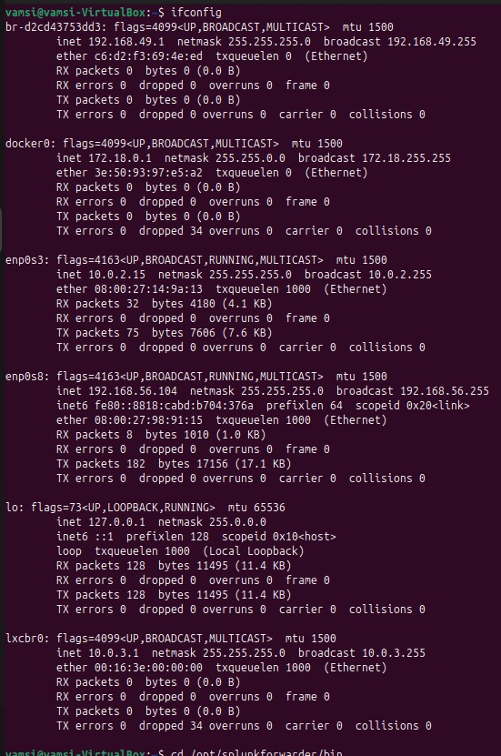

`ifconfig` (interface configuration) displays all active network interfaces with their IP addresses, MAC addresses, and traffic statistics. On the Ubuntu victim machine, this confirms the IP address that will be targeted by the Nmap scan and that it is reachable on the same Host-Only subnet.

```bash
ifconfig
```

The **enp0s8** interface showed the IP address `192.168.56.104`, confirming it was on the same Host-Only network.

---

### Windows Splunk Server — `ipconfig`
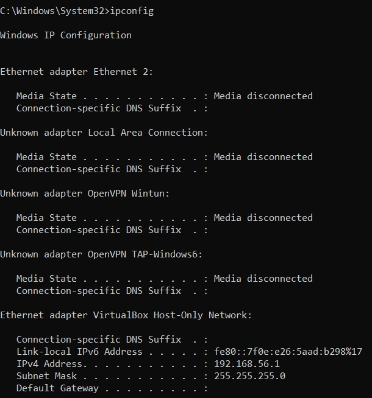

`ipconfig` is the Windows equivalent of `ifconfig`. It displays all active network adapters and their assigned IPs. On the Windows Splunk Enterprise server, this confirms the IP that the Ubuntu Splunk Universal Forwarder must point to on port `9997` to deliver logs.

```cmd
ipconfig
```

The **VirtualBox Host-Only Network** adapter showed the IP address `192.168.56.1`, which serves as the Splunk Enterprise server address.

---
## Step 2 — Network Verification (Ping Test)
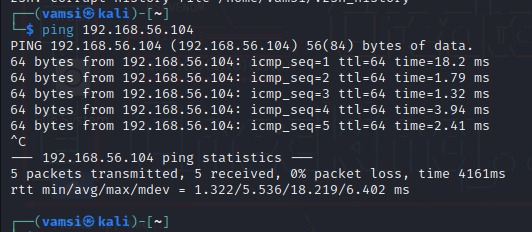

Before performing any scanning, it was essential to verify that **Kali Linux** and **Ubuntu** could communicate with each other on the same Host-Only network.

A ping test was performed from Kali Linux to Ubuntu:
`ping` sends ICMP Echo Request packets to the target IP and waits for ICMP Echo Reply responses. It is the most basic network connectivity test — if Ubuntu replies, the two machines can communicate, and the Nmap scan will reach its target.

```bash
ping 192.168.56.104
```
**0% packet loss** confirmed that both machines were reachable within the VirtualBox Host-Only network.

---

## Step 3 — Splunk Universal Forwarder Setup
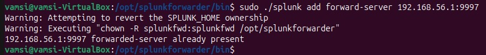
The **Splunk Universal Forwarder** had already been installed on the Ubuntu VM at `/opt/splunkforwarder/` before this lab session. This step verifies the existing installation and confirms the forward server configuration was in place.

---

## Step 4 — Initial Problem: Inactive Forward Server
To verify whether the Universal Forwarder was successfully communicating with the Splunk Enterprise server, the following command was run from the forwarder binary directory on Ubuntu:

### Problem Encountered
To verify the current forwarding status, the following command was run from the Splunk forwarder binary directory:

```bash
sudo /opt/splunkforwarder/bin/splunk list forward-server
```


When the forwarding status was checked, the output showed:
`list forward-server` queries the current state of all configured forwarding destinations. It reports whether each destination is **active** (reachable, data is flowing) or **inactive** (configured but unreachable).
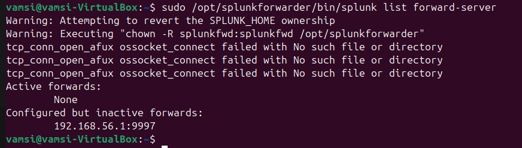
### Root Cause

After investigation, the root cause was confirmed: **Windows Defender Firewall** was blocking all inbound TCP traffic on port `9997`. Even though the Splunk Enterprise server was running and listening, the Windows firewall was silently dropping all connection attempts from the Ubuntu forwarder before they could reach Splunk.

---

## Step 5 — Fixing the Issue: Windows Defender Firewall Configuration

To resolve the blocked connection, a new **Inbound Firewall Rule** was created in **Windows Defender Firewall with Advanced Security** to explicitly allow TCP traffic on port `9997`.

### Step-by-Step Firewall Rule Creation

**Step 5.1 — Open Windows Defender Firewall**
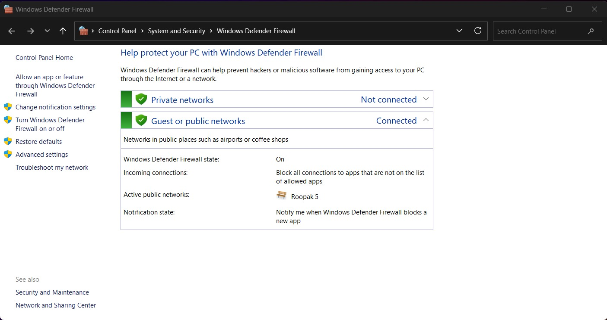

Navigate to:
`Control Panel → System and Security → Windows Defender Firewall`

The firewall was active on the Public network profile, blocking all inbound connections by default.


---

**Step 5.2 — Open Advanced Security Settings**
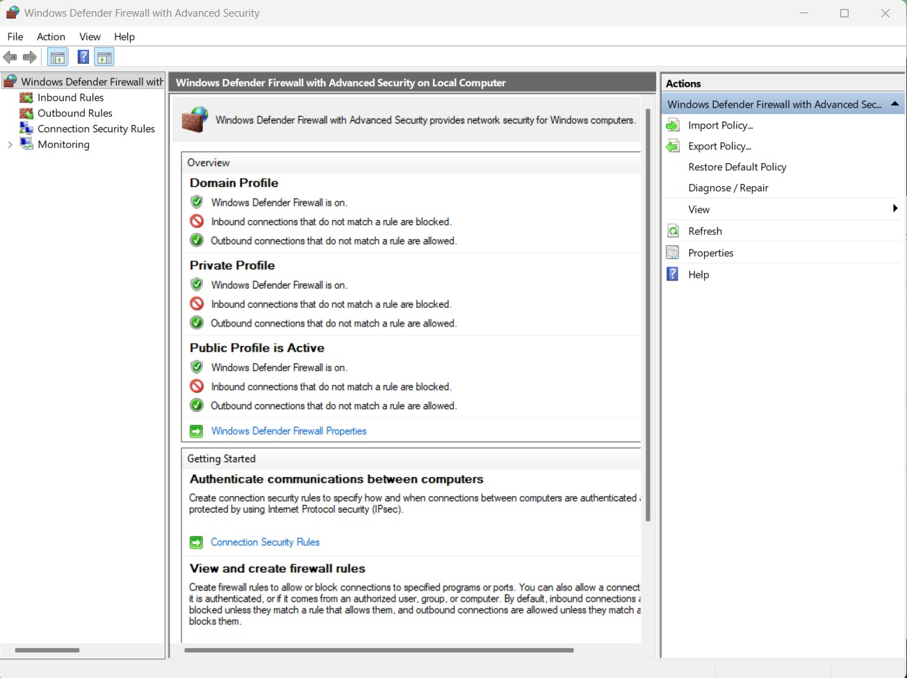

Click on **Advanced settings** to open **Windows Defender Firewall with Advanced Security**. This confirms:
- Firewall is ON for Domain, Private, and Public profiles.
- Inbound connections that do not match a rule are **blocked**.

---

**Step 5.3 — Navigate to Inbound Rules**
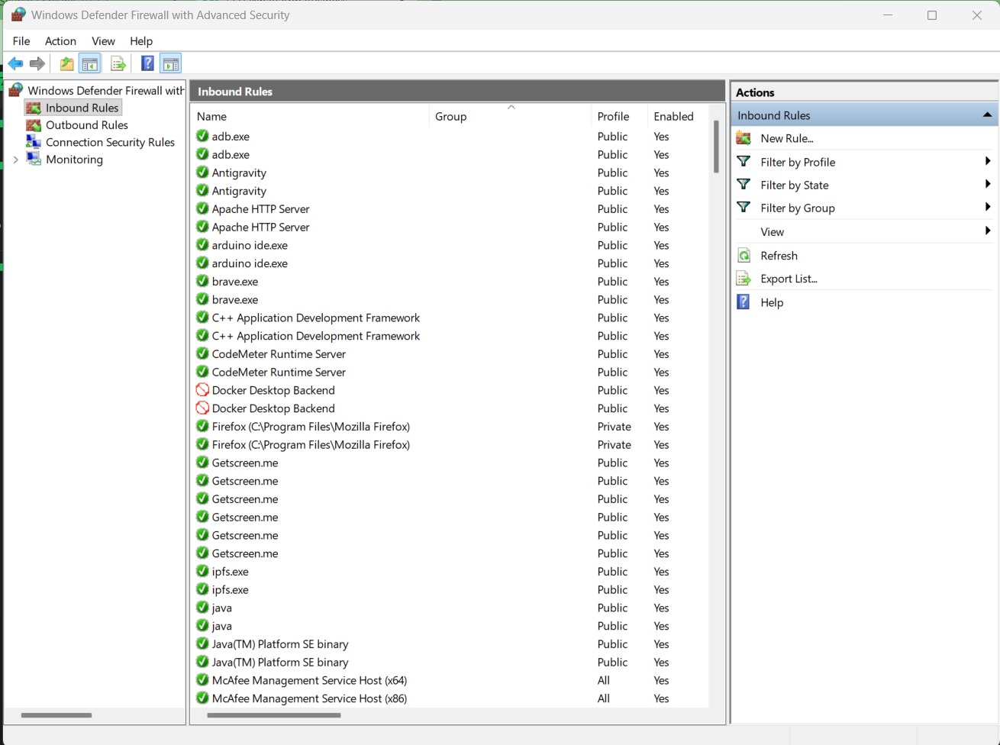

Click on **Inbound Rules** in the left panel, then click **New Rule...** in the Actions panel on the right.

---

**Step 5.4 — Rule Type: Port**
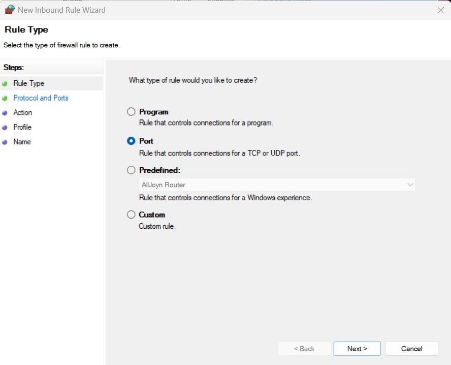

In the New Inbound Rule Wizard, select **Port** as the rule type.

| Setting | Value |
|---------|-------|
| Rule Type | Port |

---

**Step 5.5 — Protocol and Ports**
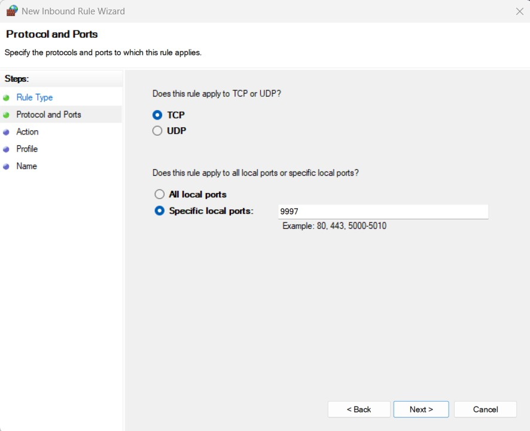

Select **TCP** and specify **Specific local ports** as `9997`.

| Setting | Value |
|---------|-------|
| Protocol | TCP |
| Specific local ports | 9997 |

---

**Step 5.6 — Action: Allow the Connection**
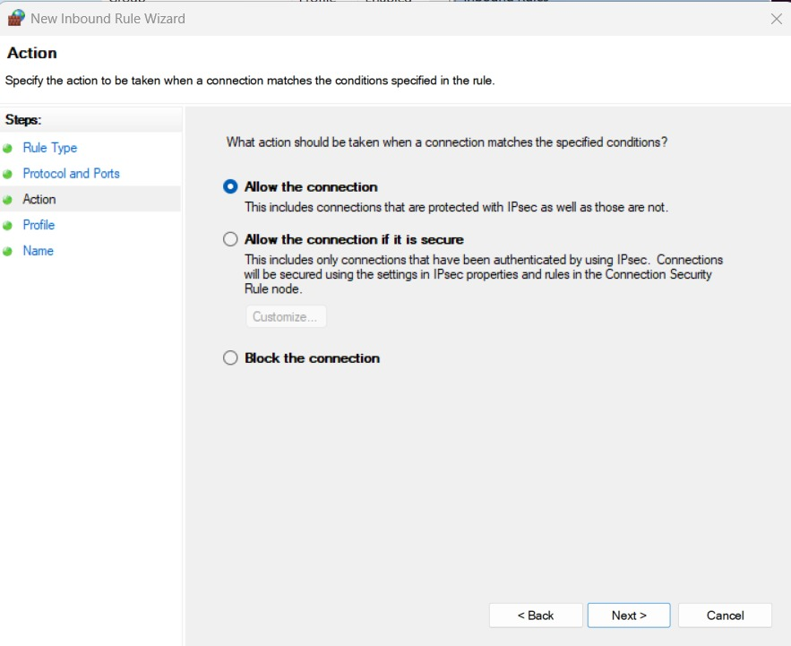

Select **Allow the connection** to permit Splunk forwarder traffic on port 9997.

| Setting | Value |
|---------|-------|
| Action | Allow the connection |

---

**Step 5.7 — Profile: Apply to All Profiles**
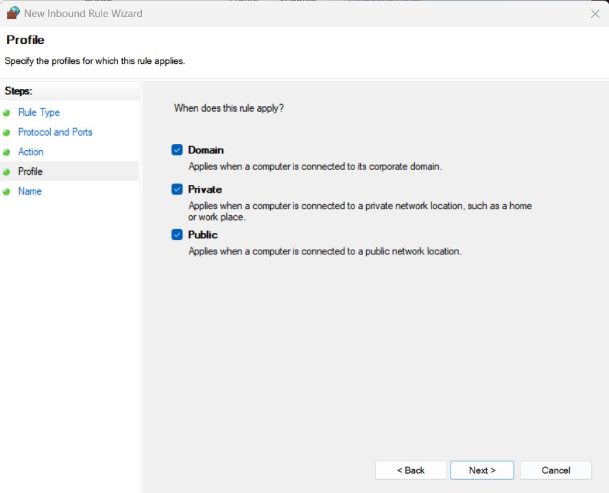

Leave all three profiles checked so the rule applies regardless of network type.

| Profile | Applied |
|---------|---------|
| Domain | ✅ Yes |
| Private | ✅ Yes |
| Public | ✅ Yes |

---

**Step 5.8 — Name the Rule**
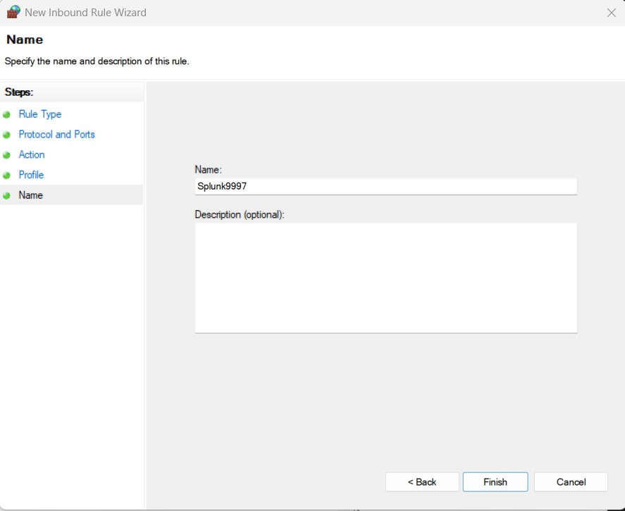

Name the rule `Splunk9997` to clearly identify it.

| Setting | Value |
|---------|-------|
| Rule Name | Splunk9997 |

Click **Finish** to create the rule.

---

## Step 6 — Restarting Services
After creating the firewall rule, both Splunk services need to be restarted to establish a fresh connection with the newly opened port.

### Restart Splunk Enterprise (Windows)

On Windows, open **Services** (`services.msc`), locate **Splunk** in the list, right-click, and select **Restart**. This forces Splunk Enterprise to reinitialize its receiver and begin accepting inbound connections on port `9997`.

### Restart Splunk Universal Forwarder (Ubuntu)
`splunk restart` gracefully stops the forwarder process and starts it again. This causes the forwarder to re-initiate the TCP connection to `192.168.56.1:9997`. With the Windows firewall rule now in place, this connection attempt will succeed.

The Splunk forwarder was restarted on Ubuntu using:
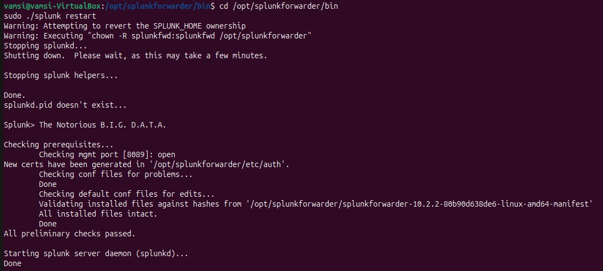

```bash
cd /opt/splunkforwarder/bin
sudo ./splunk restart
```
---
## Step 7 — Successful Connection Verification
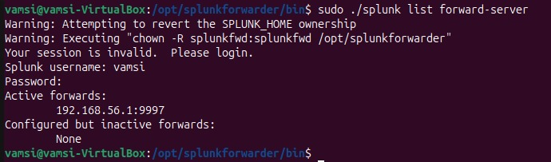

After restarting both services, the forward server status was re-checked to confirm the connection was established.

```bash
sudo ./splunk list forward-server
```

The forward server status changed from **inactive → active**, confirming that the **Ubuntu Splunk Universal Forwarder** was successfully communicating with the **Windows Splunk Enterprise** server on port 9997.

**The root cause** (Windows Defender Firewall blocking port 9997) was fully resolved by adding the `Splunk9997` inbound rule.

---

## Step 8 — Performing the Nmap SYN Scan
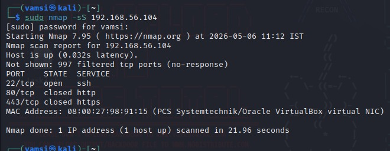

With the complete logging and forwarding infrastructure confirmed to be working, the Nmap SYN scan was launched from **Kali Linux** against the **Ubuntu victim machine**.

### Command Used

```bash
sudo nmap -sS 192.168.56.104
```
On the Kali Linux terminal, run `sudo nmap -sS 192.168.56.104`. The scan probes all 1,000 most common ports. Wait for it to complete (typically 5–15 seconds on a local network) and the results table will be displayed.

### How a SYN Scan Works

```
Kali Linux                          Ubuntu (Victim)
    │                                     │
    │ ──── SYN (port 22) ──────────────► │
    │ ◄─── SYN-ACK ──────────────────── │  (Port OPEN)
    │ ──── RST ───────────────────────► │  (Connection aborted — never completed)
    │                                     │
    │ ──── SYN (port 80) ──────────────► │
    │ ◄─── RST ───────────────────────── │  (Port CLOSED)
    │                                     │
    │ ──── SYN (port 443) ─────────────► │
    │ ◄─── RST ───────────────────────── │  (Port CLOSED)
```

| Scan Characteristic | Description |
|---------------------|-------------|
| Scan Type | Half-Open / Stealth Scan |
| Packets Sent | TCP SYN |
| Open Port Response | SYN-ACK (then RST sent by attacker) |
| Closed Port Response | RST |
| Handshake Completed? |  No |

SYN scans require **root/sudo** privileges because they require raw socket access.

---

### Analysis of Results

| Port | State | Service | Interpretation |
|------|-------|---------|----------------|
| 22/tcp | Open | SSH | SSH service is actively listening — received SYN-ACK |
| 80/tcp | Closed | HTTP | HTTP port not in use — received RST |
| 443/tcp | Closed | HTTPS | HTTPS port not in use — received RST |

The 997 filtered ports returned no response, indicating they are behind a firewall.

**Detection insight:** While port 22 responded (open) and some ports sent RST (closed), the **997 filtered ports** each generated a `[UFW BLOCK]` entry in Ubuntu's syslog. This rapid burst of blocked SYN packets — all from `192.168.56.103`, all within milliseconds of each other, all to different destination ports — is exactly what Splunk will surface as evidence of a port scan.

---

## Step 9 — Log Collection Process

When the Nmap SYN scan was executed, the following log collection pipeline was triggered:

```
1. Kali Linux sent SYN packets to 192.168.56.104
         ↓
2. Ubuntu's kernel (via firewall rules) logged each
   SYN packet as a [UFW BLOCK] entry in /var/log/syslog
         ↓
3. Splunk Universal Forwarder (running on Ubuntu)
   continuously monitored /var/log/syslog for new entries
         ↓
4. New log lines were forwarded in real time over TCP port 9997
   to Splunk Enterprise on Windows (192.168.56.1)
         ↓
5. Splunk Enterprise indexed the forwarded logs
   and made them searchable for analysis
```

Each SYN packet to a different destination port generated a **separate log entry**, creating a clear pattern of port scanning activity in the SIEM.

---

## Step 10 — Searching Logs in Splunk Enterprise
With all scan-related logs indexed in Splunk, SPL (Splunk Processing Language) queries were used to find and analyze the scanning events.
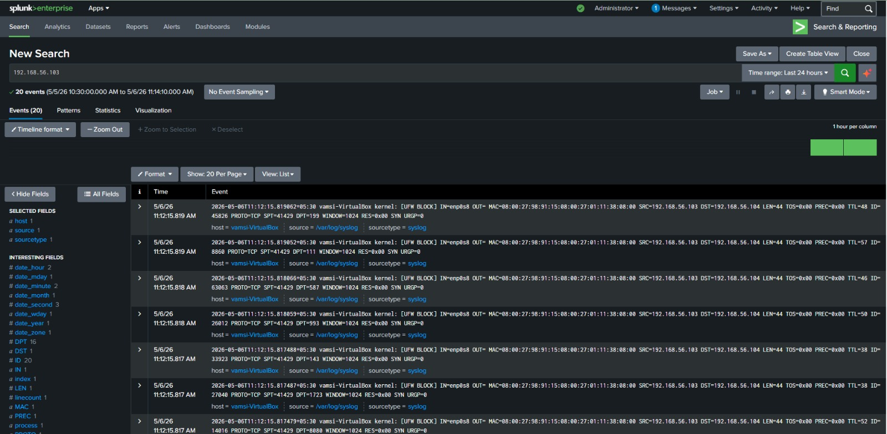


### Search by Attacker IP

In the Splunk Search & Reporting app, the following search was used to find all events originating from the Kali Linux attacker:

```spl
192.168.56.103
```

This returned **20 events** within the last 24 hours, all timestamped around the time the scan was performed (`2026-05-06T11:12:xx`).

---

## Step 11 — Log Analysis

### Sample Log Entry
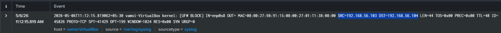

```
2026-05-06T11:12:15.819062+05:30 vamsi-VirtualBox kernel: 
[UFW BLOCK] IN=enp0s8 OUT= MAC=08:00:27:98:91:15:08:00:27:01:11:38:08:00 
SRC=192.168.56.103 DST=192.168.56.104 LEN=44 TOS=0x00 PREC=0x00 
TTL=48 ID=45826 PROTO=TCP SPT=41429 DPT=199 WINDOW=1024 RES=0x00 SYN URGP=0
```

### Field Breakdown

| Field | Value (Example) | Meaning |
|-------|----------------|---------|
| `[UFW BLOCK]` | — | Packet was blocked by the firewall rule |
| `IN` | `enp0s8` | Network interface that received the packet |
| `SRC` | `192.168.56.103` | **Source IP — Kali Linux (Attacker)** |
| `DST` | `192.168.56.104` | **Destination IP — Ubuntu (Victim)** |
| `PROTO` | `TCP` | Protocol used — TCP confirms SYN scan |
| `SPT` | `41429` | Source Port (randomly assigned by Nmap) |
| `DPT` | `199` | **Destination Port — the port being scanned** |
| `SYN` | present | **SYN flag set — confirms this is a SYN packet** |
| `WINDOW` | `1024` | TCP window size (fixed value typical of Nmap) |
| `URGP` | `0` | No urgent pointer set |
| `TTL` | `48` | Time-to-live of the packet |

### Why This Indicates Port Scanning

The critical indicator in these logs is the **`DPT` (Destination Port) field**. Across the 20 events captured, the `DPT` value was **different in every single log entry** — ranging across ports like 199, 111, 587, 993, 143, 1723, and many others. This pattern of:

- **Same source IP** (`192.168.56.103`)
- **Same destination IP** (`192.168.56.104`)
- **Same time window** (within milliseconds of each other)
- **Different destination ports** in rapid succession
- **SYN flag** present in every packet

The Splunk SIEM successfully captured and displayed all of this evidence in a single searchable interface.

---
