# SSH Brute Force Attack
## Objective

This lab simulates a real-world SSH brute force attack scenario. The key learning goals are:

- **Understanding SSH authentication logging** — Learn how Linux systems record login attempts in `/var/log/auth.log` and identify the difference between failed and successful entries
- **Simulating repeated failed SSH login attempts safely** — Use Kali Linux to manually attempt logins with wrong passwords against an Ubuntu victim machine
- **Monitoring logs using Splunk Enterprise** — Forward auth logs from the Ubuntu machine to Splunk via the Universal Forwarder and visualize events in real time
- **Detecting brute-force behavior** — Write SPL (Splunk Processing Language) queries to identify patterns consistent with brute force attacks


---

## Lab Architecture

| Machine               | OS / Version           | Role                          | IP Address       |
| --------------------- | ---------------------- | ----------------------------- | ---------------- |
| Kali Linux            | Kali Rolling           | Attacker / Test Machine       | 192.168.56.103   |
| Ubuntu VM             | Ubuntu 24.04.4 LTS     | Victim SSH Server             | 192.168.56.104   |
| Splunk Enterprise     | Splunk Enterprise 9.x  | SIEM Monitoring Server        | 192.168.56.1   |

All machines are connected over a **Host-Only network** (`192.168.56.0/24`) in VirtualBox to simulate an isolated internal network.

---

## Tools & Technologies Used

| Tool                        | Purpose                                                   |
| --------------------------- | --------------------------------------------------------- |
| **Kali Linux**              | Attacker machine used to simulate SSH login attempts      |
| **Ubuntu 24.04 LTS**        | Target SSH server; victim in the brute force scenario     |
| **OpenSSH Server**          | SSH daemon running on Ubuntu to accept/reject connections |
| **Splunk Enterprise**       | SIEM platform used to ingest, search, and alert on logs   |
| **Splunk Universal Forwarder** | Lightweight agent on Ubuntu that ships logs to Splunk  |
| **VirtualBox**              | Hypervisor used to run and isolate all virtual machines   |

---

## Step 1: Configure SSH Server on Ubuntu

Before any attack simulation can take place, the Ubuntu VM must be configured as an SSH server. This involves installing the OpenSSH package, enabling it to start at boot, and verifying it is running.

### 1.1 — Install and Start OpenSSH Server

Run the following commands on the **Ubuntu VM**:

```bash
# Update package repositories
sudo apt update

# Install the OpenSSH server package
sudo apt install openssh-server -y

# Enable SSH to start automatically at boot
sudo systemctl enable ssh

# Start the SSH service immediately
sudo systemctl start ssh

# Verify SSH is running
sudo systemctl status ssh
```

**Command Explanations:**

| Command | Purpose |
|---|---|
| `sudo apt update` | Refreshes the local package index from Ubuntu repositories |
| `sudo apt install openssh-server -y` | Installs the OpenSSH server; `-y` auto-confirms the prompt |
| `sudo systemctl enable ssh` | Ensures SSH starts automatically on every reboot |
| `sudo systemctl start ssh` | Starts the SSH daemon immediately without rebooting |
| `sudo systemctl status ssh` | Confirms the service is active and listening |

---

### 1.2 — Installing OpenSSH Server

The screenshot below shows the output of `sudo apt install openssh-server -y` on the Ubuntu VM. The system reports that `openssh-server` is already at the newest version (`1:9.6p1-3ubuntu13.16`), confirming the package is installed and ready.
```bash
sudo apt install openssh-server -y
```
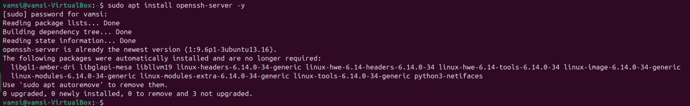

If you see `0 upgraded, 0 newly installed` it means the package was already present. The SSH server is ready to use.

---

### 1.3 — Verifying SSH Service Status

After installation, we verify the SSH service is actively running using `sudo systemctl status ssh`.
```bash
sudo systemctl status ssh
```
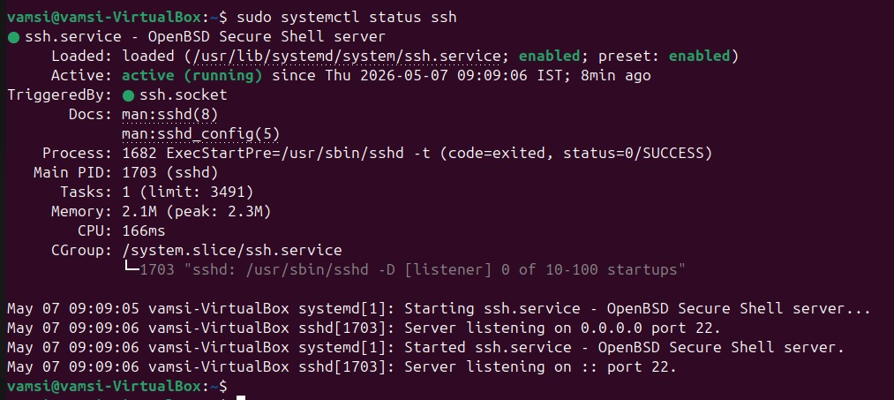

**Key indicators to look for in this output:**

- `Active: active (running)` — The SSH daemon is live and accepting connections
- `Server listening on 0.0.0.0 port 22` — Listening on all IPv4 interfaces
- `Server listening on :: port 22` — Also listening on IPv6
- `Loaded: enabled` — Will persist across reboots

The service started at `09:09:06 IST` and has been running for 8 minutes, confirming a healthy SSH setup.

---

### 1.4 — Finding Ubuntu's IP Address

To connect from Kali Linux, we need the Ubuntu VM's IP address. Run `ifconfig` on Ubuntu:

```bash
ifconfig
```

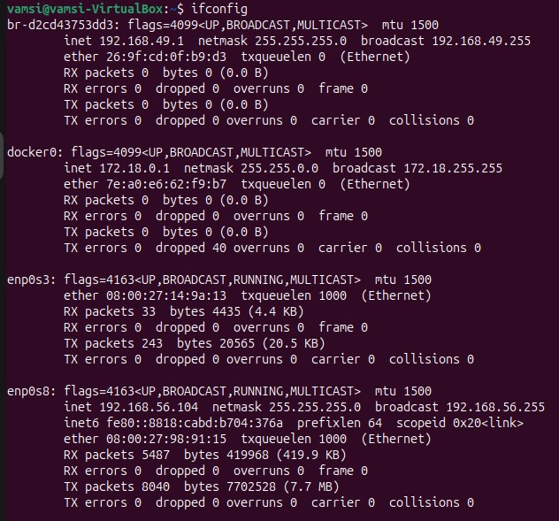

**Reading the output:**

- Interface `enp0s8` has the IP `192.168.56.104` — this is on the Host-Only network (`192.168.56.0/24`)
- This is the IP that Kali Linux will use to connect via SSH

**Ubuntu Victim IP: `192.168.56.104`** — note this down; it will be used throughout the lab.

---

### 1.5 — Kali Linux Network Verification

On the **Kali Linux VM**, confirm it is on the same Host-Only network:

```bash
ip a
```

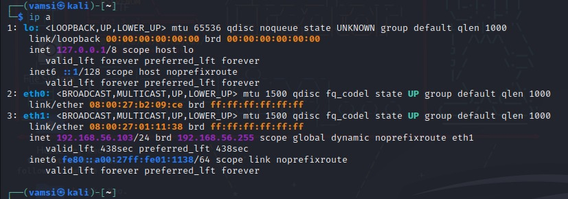

**Reading the output:**

- Interface `eth1` has IP `192.168.56.103` — same `/24` subnet as Ubuntu
- Both machines can communicate directly over this Host-Only network

**Kali Attacker IP: `192.168.56.103`** — both machines are now on the same subnet and can reach each other.

---

## Step 2: Verify SSH Connection from Kali

Before simulating brute force, confirm that SSH connectivity works correctly between Kali and Ubuntu with valid credentials.

### 2.1 — Connecting via SSH

On the **Kali Linux VM**, open the terminal and run the below command:

```bash
ssh vamsi@192.168.56.104
```

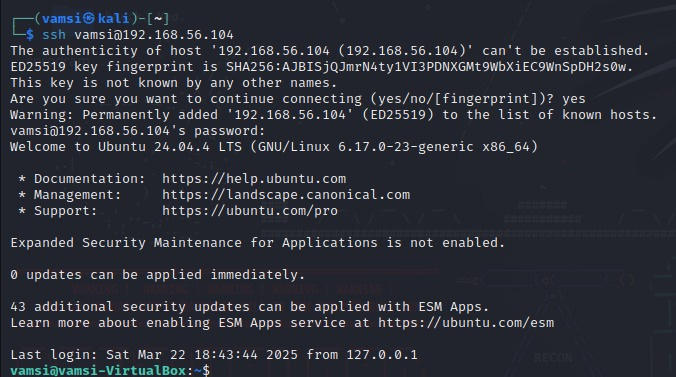

**What happens during this first connection:**

1. **Host fingerprint warning** — SSH displays a warning because this is the first connection to `192.168.56.104`. The message reads:
   > `The authenticity of host '192.168.56.104' can't be established.`
2. **ED25519 key fingerprint** — The server's public key fingerprint is shown for verification
3. **Accept the fingerprint** — Type `yes` to accept and add the host to `~/.ssh/known_hosts`
4. **Password prompt** — Enter the correct password for user `vamsi`
5. **Successful login** — Ubuntu 24.04.4 LTS welcome banner is displayed
6. **Session active** — Prompt changes to `vamsi@vamsi-VirtualBox:~$`, confirming you are now inside the Ubuntu VM

Successful SSH login from Kali to Ubuntu confirms the network path and credentials are working correctly. This also generates an `Accepted password` event in `/var/log/auth.log`.

---

### 2.2 — Logging Out of SSH

After verifying connectivity, using `exit` word we can exit the SSH session and getting back to kali machine:

```bash
exit
```

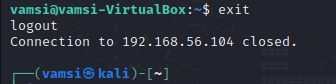

The terminal shows `logout` and `Connection to 192.168.56.104 closed`, confirming the session ended cleanly. The prompt returns to `(vamsi㉿kali)-[~]`, indicating you are back on the Kali machine.

---

## Step 3: Monitoring SSH Logs on Ubuntu

SSH authentication events are recorded in real time in Ubuntu's auth log. Understanding this log is critical before and after the attack simulation.

### 3.1 — Tailing the Auth Log on Ubuntu

On the **Ubuntu VM**, open a terminal and run:

```bash
sudo tail -f /var/log/auth.log
```

The `-f` flag means **follow** — the terminal will continuously stream new log entries as they are written.

This command is used to continuously monitor and view the latest authentication logs on the Ubuntu system in real time.

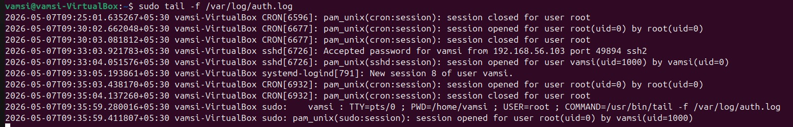

**Sample log entries explained:**

```
2026-05-07T09:33:03 vamsi-VirtualBox sshd[6726]: Accepted password for vamsi from 192.168.56.103 port 49894 ssh2
```
→ Successful SSH login for user `vamsi` from Kali IP `192.168.56.103`

```
2026-05-07T09:30:02 vamsi-VirtualBox CRON[6677]: pam_unix(cron:session): session opened for user root(uid=0)
```
→ Scheduled cron job activity (background noise, not SSH-related)

Keep this terminal open during the brute force simulation in the next step so you can watch failed login events appear in real time.

---

##  Step 4: Simulate SSH Brute Force Attack

Now we simulate a brute force attack by repeatedly entering wrong passwords during an SSH login attempt from Kali Linux.

### 4.1 — Generating Failed Login Attempts

On the **Kali Linux VM**, connect to the Ubuntu machine and intentionally enter wrong passwords:

```bash
ssh vamsi@192.168.56.104
```

When prompted for a password, i entered wrong passwords two times and correct password for the third time. SSH allows 3 attempts per connection by default before closing. Reconnect and repeat to generate multiple failed events.

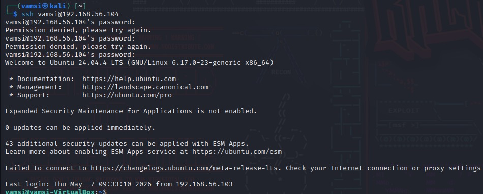

**What this screenshot shows:**

- `Permission denied, please try again.` — SSH rejected the wrong password (attempt 1)
- `Permission denied, please try again.` — Second failed attempt
- On the third password prompt, the correct password was entered
- The Ubuntu welcome banner appears, confirming eventual successful login
- This pattern — multiple failures followed by success — is the hallmark of a brute force attack

**Attacker perspective:** In a real brute force attack, tools like `hydra` or `medusa` automate this process, trying thousands of passwords per second. Here we simulate it manually for safe, educational purposes.

---

## Step 5: Observing Brute Force in Auth Logs

Now switch to the **Ubuntu VM** where `auth.log` is being followed. Here we can see the failed and accepted password events appear in real time.
Since i entered wrong passwords 2 times and entered the correct password for the third time in kali machine. Here we can see that there `two logs` with `Failed Password` and `one log` with `Accepted Password`. 

```bash
sudo tail -f /var/log/auth.log
```

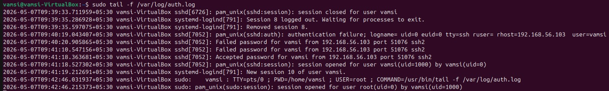

**Detailed log analysis:**

```
2026-05-07T09:40:19 sshd[7052]: pam_unix(sshd:auth): authentication failure; logname= uid=0 euid=0 tty=ssh ruser= rhost=192.168.56.103 user=vamsi
```
→ PAM authentication failure recorded at the system level for user `vamsi` from `192.168.56.103`

```
2026-05-07T09:40:20 sshd[7052]: Failed password for vamsi from 192.168.56.103 port 51076 ssh2
```
→ First **Failed password** event — this is what we search for in Splunk

```
2026-05-07T09:41:10 sshd[7052]: Failed password for vamsi from 192.168.56.103 port 51076 ssh2
```
→ Second **Failed password** event from the same source and port

```
2026-05-07T09:41:18 sshd[7052]: Accepted password for vamsi from 192.168.56.103 port 51076 ssh2
```
→ **Accepted password** — successful login after multiple failures (classic brute force pattern)

```
2026-05-07T09:39:33 sshd[6726]: pam_unix(sshd:session): session closed for user vamsi
```
→ Previous session logout recorded before the new attack sequence began

**Detection Signal:** Multiple `Failed password` events from the **same source IP** (`192.168.56.103`) within a short time window, followed by an `Accepted password`, is a strong indicator of a successful brute force attack.

---

## Step 6: Searching SSH Logs in Splunk

With logs flowing from Ubuntu into Splunk, we can now run SPL (Splunk Processing Language) queries to find SSH authentication events.

### 6.1 — Search All Indexed Events

Open **Splunk Search & Reporting** and run:

```spl
index="main"
```
This query displays all logs from the Ubuntu system stored in the main index in Splunk.

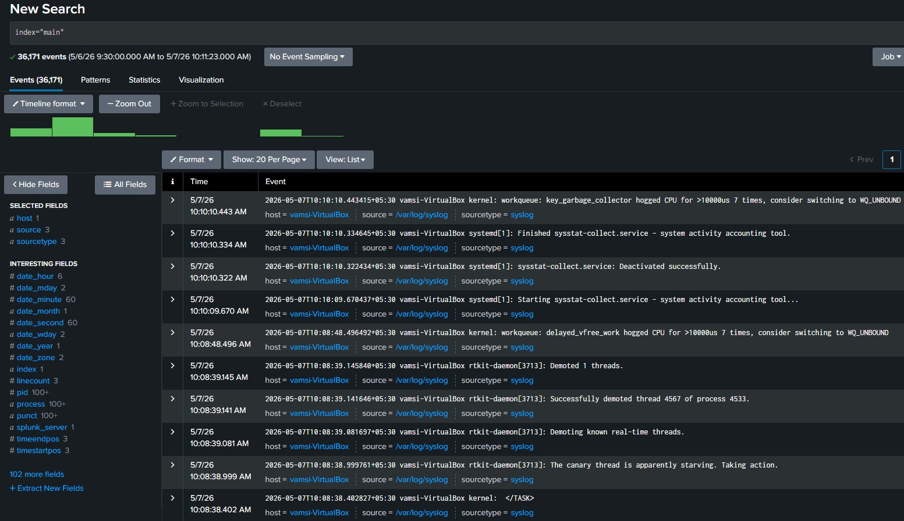

**What this shows:**
- `36,171 events` indexed from the Ubuntu VM between May 6–7, 2026
- Events are sourced from `/var/log/syslog` and `/var/log/auth.log`
- The timeline shows event distribution over time
- Left panel shows field discovery: `host`, `source`, `sourcetype`, `pid`, `process`, etc.
- This confirms the Splunk Universal Forwarder is successfully shipping logs to Splunk Enterprise

Seeing events here confirms the entire log pipeline — Ubuntu → Forwarder → Splunk — is working correctly.

---

### 6.2 — Search for Failed Password Events

```spl
index=* "Failed password"
```
This query displays all logs with words `Failed password` which is easy to identify failed logins.

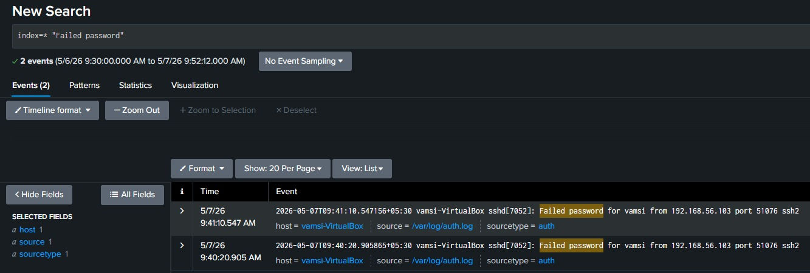

**What this shows:**
- `2 events` returned matching `Failed password`
- Both events are from `2026-05-07` at approximately `09:40` and `09:41`
- Source: `/var/log/auth.log` | Sourcetype: `auth`
- Host: `vamsi-VirtualBox` (the Ubuntu victim machine)

**Sample events:**
```
2026-05-07T09:41:10 vamsi-VirtualBox sshd[7052]: Failed password for vamsi from 192.168.56.103 port 51076 ssh2
2026-05-07T09:40:20 vamsi-VirtualBox sshd[7052]: Failed password for vamsi from 192.168.56.103 port 51076 ssh2
```

Both failed attempts originated from `192.168.56.103` (Kali Linux), confirming Splunk captured the simulated brute force events.

---

### 6.3 — Search for Successful Login Events

```spl
index=* "Accepted password"
```
This query displays all logs with words `Accepted password` which is easy to identify Successful logins.

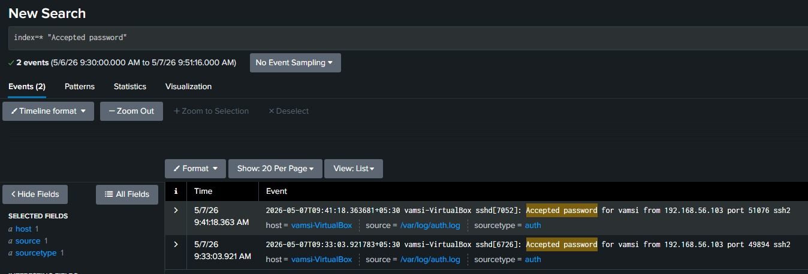

**What this shows:**
- `2 events` returned matching `Accepted password`
- First successful login at `09:33:03` (initial connectivity test)
- Second successful login at `09:41:18` (after brute force simulation — eventual correct guess)
- Source: `/var/log/auth.log` | Sourcetype: `auth`

**Sample events:**
```
2026-05-07T09:41:18 vamsi-VirtualBox sshd[7052]: Accepted password for vamsi from 192.168.56.103 port 51076 ssh2
2026-05-07T09:33:03 vamsi-VirtualBox sshd[6726]: Accepted password for vamsi from 192.168.56.103 port 49894 ssh2
```

The second `Accepted password` at `09:41:18` occurring right after two `Failed password` events (at `09:40:20` and `09:41:10`) is the classic brute force success pattern — multiple failures then a successful login.

---

## Conclusion

This task demonstrated a fundamental but critical cybersecurity detection scenario: identifying SSH brute force attacks using a SIEM platform.

**Key takeaways:**

- **SIEM monitoring is essential** — Without a centralized log aggregation platform like Splunk, SSH failed logins would silently accumulate in isolated system logs, invisible to the security team until after a breach
- **Real-time log forwarding closes the visibility gap** — The Splunk Universal Forwarder enables near-instant telemetry from endpoints to the SIEM, reducing detection latency from hours to minutes
- **SPL empowers threat hunting** — Writing targeted queries to extract fields from raw syslog data (using `rex`) and applying statistical thresholds (using `stats` and `where`) is a core SOC analyst skill that this lab directly develops
- **Threshold-based alerting is the foundation of automated detection** — Defining what "normal" looks like (occasional failed logins) versus "anomalous" (5+ failures in 10 minutes) and encoding that logic as a Splunk alert mirrors how production Security Operations Centers operate
- **SSH brute force remains a real threat** — Internet-facing SSH services are a constant target. Even in modern environments, password-based SSH is frequently exploited, making detection capabilities like those built in this lab directly applicable to real-world security operations

---
