# Splunk Enterprise Installation Guide (Windows)

This guide documents the step-by-step process of installing and accessing **Splunk Enterprise 10.2.2** on a Windows machine.

---

## Prerequisites

- Windows Server 2019 / 2022 / 2025 (64-bit)
- At least **1 GB** of free disk space for the installer
- A valid Splunk account (free trial available)
- Administrator privileges on the machine

---

## Step 1 — Download Splunk Enterprise

Visit the official Splunk download page and select the Windows `.msi` package.

 **Version:** Splunk Enterprise 10.2.2  
 **Package Size:** ~1026 MB  
 **Supported OS:** Windows Server 2019, 2022, 2025 (64-bit)

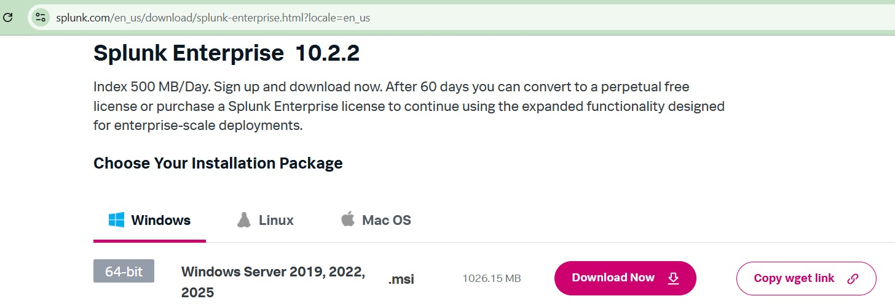

**Download steps:**
1. Go to [splunk.com/download](https://www.splunk.com/en_us/download/splunk-enterprise.html)
2. Select the **Windows** tab
3. Click **Download Now** next to the 64-bit `.msi` installer
4. Sign in or create a free Splunk account if prompted

**Note:** The free trial allows indexing up to **500 MB/day**. After 60 days, you can convert to a perpetual free license or upgrade to a full Enterprise license.

---

## Step 2 — Install & Create Admin Credentials

Run the downloaded `.msi` installer and follow the on-screen wizard. During installation, you will be prompted to **create an admin username and password** — these credentials will be used to log into the Splunk Web interface.

**Important:** Remember your credentials. If lost, a password reset requires access to the Splunk server directly.

After installation completes, Splunk Enterprise starts automatically and is accessible at:

```
http://localhost:8000
```

---

## Step 3 — Log In to Splunk Web

Open your browser and navigate to `http://localhost:8000`. Enter the **username and password** you created during installation.

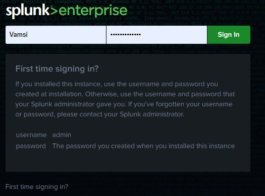

**Login details (default):**

| Field    | Value                                      |
|----------|--------------------------------------------|
| Username | The username you set during installation   |
| Password | The password you set during installation   |

**First time signing in?** Use the credentials you created at installation. If this is a shared instance, contact your Splunk administrator.

---

## Step 4 — Splunk Home Dashboard

After a successful login, you will land on the **Splunk Home Dashboard** — the central hub for monitoring, searching, and auditing logs.

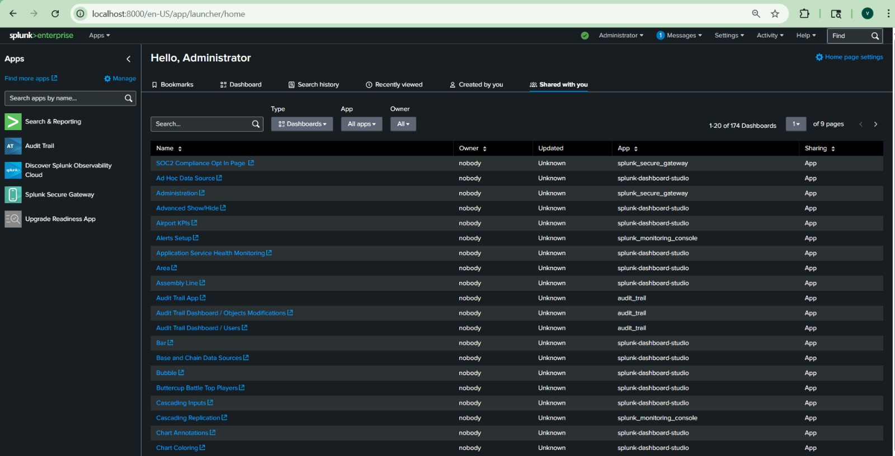

From here you can:

- **Search & Report** — Run SPL (Search Processing Language) queries on indexed data
- **Apps** — Install and manage Splunk apps (e.g., Audit Trail, Splunk Secure Gateway)
- **Dashboards** — View pre-built or custom dashboards for log monitoring and analytics
- **Settings** — Configure data inputs, indexes, users, and roles
- **Activity** — Review job history and triggered alerts

---

# Splunk Universal Forwarder — Setup on Ubuntu (Linux)

This section documents the installation and configuration of the **Splunk Universal Forwarder** on an Ubuntu machine (running inside Oracle VM VirtualBox), and forwarding logs to **Splunk Enterprise** running on Windows.


---

## Step 1 — Download Splunk Universal Forwarder on Ubuntu

On the Ubuntu terminal, use `wget` to download the Splunk Universal Forwarder `.deb` package directly from Splunk's official servers.

```bash
wget -O splunkforwarder-10.2.2-80b90d638de6-linux-amd64.deb "https://download.splunk.com/products/universalforwarder/releases/10.2.2/linux/splunkforwarder-10.2.2-80b90d638de6-linux-amd64.deb"
```


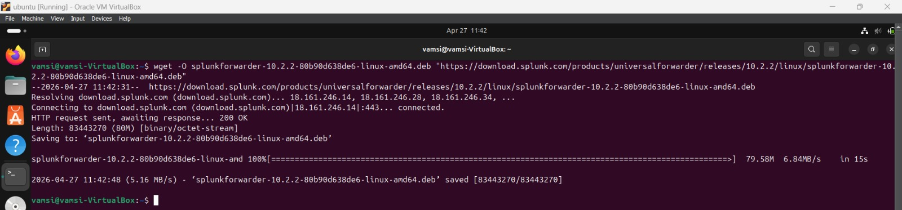

**Note:** The `wget` command fetches the file from Splunk's CDN at `download.splunk.com`. A `200 OK` HTTP response confirms a successful connection and the file saves as `splunkforwarder-10.2.2-80b90d638de6-linux-amd64.deb`.

---

## Step 2 — Verify the Downloaded File

After the download completes, confirm the `.deb` file is present in your current directory using `ls`.

```bash
ls
```

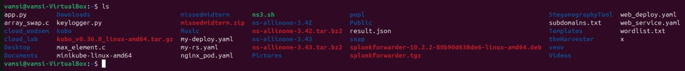

You should see `splunkforwarder-10.2.2-80b90d638de6-linux-amd64.deb` listed among your files, confirming the download was successful.

---

## Step 3 — Install the Splunk Forwarder using `dpkg`

Install the downloaded `.deb` package using the `dpkg` package manager:

```bash
sudo dpkg -i splunkforwarder-10.2.2-80b90d638de6-linux-amd64.deb
```

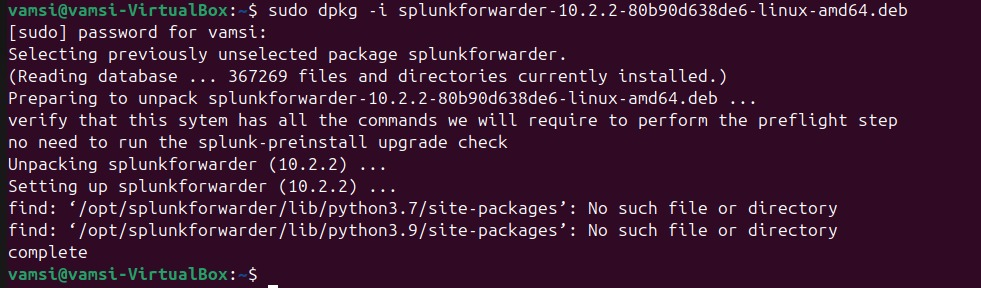

**What happens when this command is run:**
- `dpkg` selects the previously unselected package `splunkforwarder`
- It reads the existing package database (367,269 files and directories)
- It unpacks and sets up **Splunk Universal Forwarder version 10.2.2**
- The installation completes with status `complete`

The warnings about missing Python `site-packages` directories (`python3.7`, `python3.9`) are **non-critical** and can be safely ignored — they are informational messages during preflight checks.

---

## Step 4 — Start the Splunk Forwarder & Create Admin Credentials

Start the Splunk Forwarder for the first time and accept the license agreement:

```bash
sudo /opt/splunkforwarder/bin/splunk start --accept-license
```

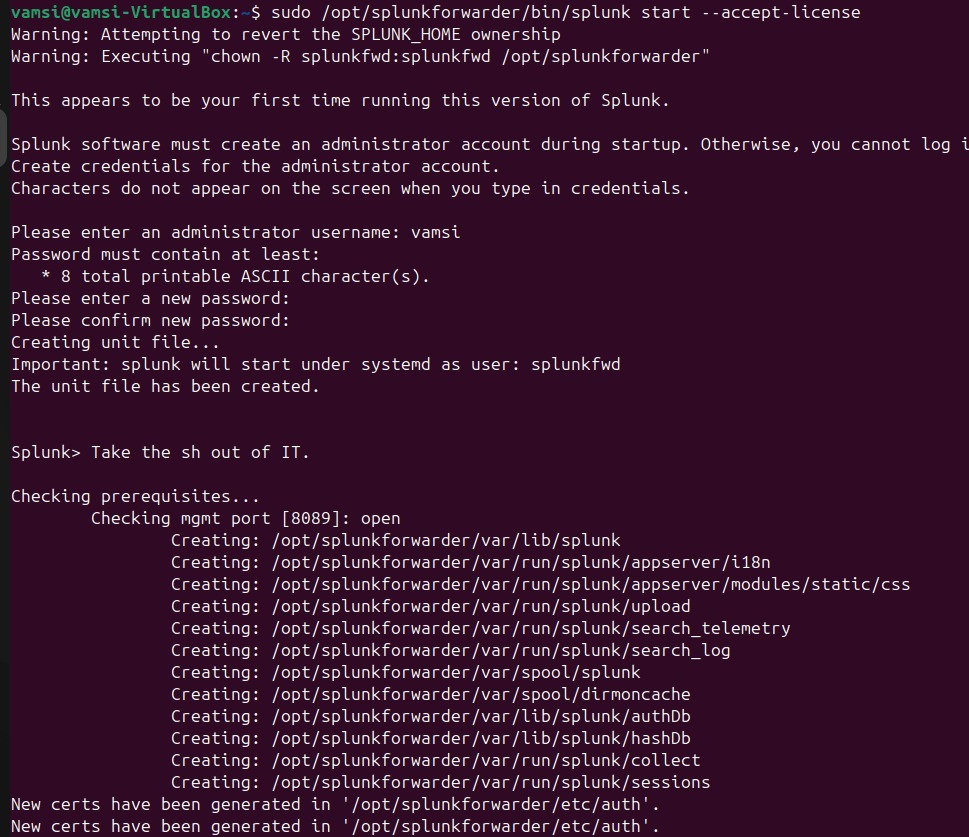
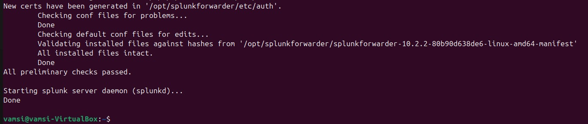

**What happens when this command is run (Images 4 & 5 together):**
- Since this is the **first time** running this version of Splunk, it requires creating an administrator account
- You are prompted to enter an **admin username** (e.g., `vamsi`) and a **password** (minimum 8 printable ASCII characters)
- Splunk creates a **systemd unit file** and sets the service to run as user `splunkfwd`
- It then runs preflight checks — verifying config files, validating installed files against the manifest hash, and checking the management port `[8089]`
- New SSL certificates are generated in `/opt/splunkforwarder/etc/auth/`
- All checks pass and the **splunkd daemon starts successfully** with output: `Done`

---

## Step 5 — Stop the Splunk Forwarder

To stop the forwarder at any point, run:

```bash
sudo /opt/splunkforwarder/bin/splunk stop
```

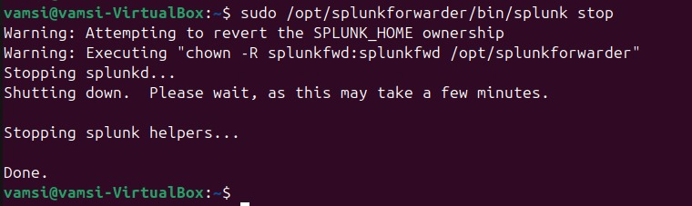

Splunk gracefully shuts down the `splunkd` daemon and all helper processes, confirming with `Done`.

---

## Step 6 — Configure Splunk Enterprise to Receive Data (Indexer Setup)

On the **Windows machine**, open Splunk Enterprise at `http://localhost:8000`, navigate to **Settings → Forwarding and Receiving → Indexes** to verify the existing indexes.

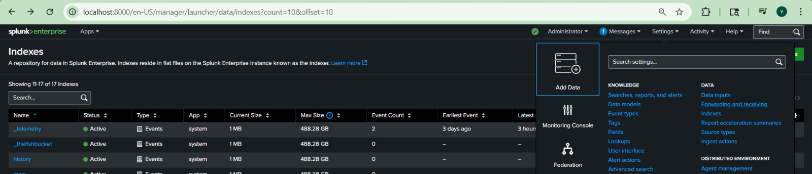

Then navigate to **Settings → Forwarding and Receiving**.

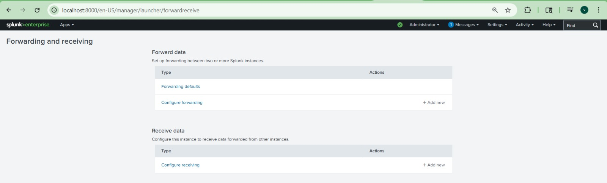

This page has two sections:
- **Forward data** — to configure this instance to send data to another Splunk instance
- **Receive data** — to configure this instance to **accept** data forwarded from other Splunk instances (forwarders)

Click **+ Add new** under **Receive data** → **Configure receiving** and enter port `9997`.

```
Port: 9997
```

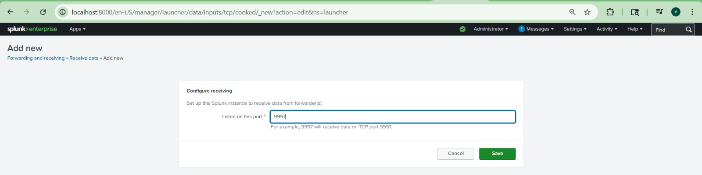

---

## Step 7 — Confirm Receiving Port is Active

After saving, Splunk confirms that port **9997** has been successfully configured and is now **Enabled**.

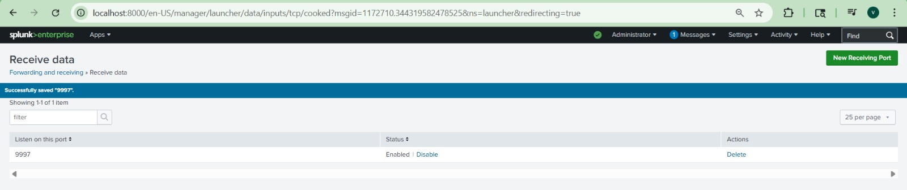

**Port 9997** is the industry-standard default port used by Splunk forwarders to send data to an indexer over TCP.

---

## Step 8 — Point the Forwarder to the Splunk Indexer (Windows IP)

Back on the **Ubuntu machine**, configure the Universal Forwarder to forward all collected logs to the Splunk Enterprise instance on Windows using its IP address and port `9997`:

```bash
sudo /opt/splunkforwarder/bin/splunk add forward-server 192.168.56.1:9997
```


> The output `Added forwarding to: 192.168.56.1:9997` confirms that the forwarder now knows where to send data. The `tcp_conn_open_afux` warnings are socket-related informational messages and do not affect functionality.

---

## Step 9 — Add Log Files to Monitor

Configure the forwarder to monitor specific Linux log files and stream them to Splunk Enterprise:

**Monitor authentication logs:**
```bash
sudo /opt/splunkforwarder/bin/splunk add monitor /var/log/auth.log
```

**Monitor APT package manager history:**
```bash
sudo /opt/splunkforwarder/bin/splunk add monitor /var/log/apt/history.log
```


**What happens:**
- `add monitor /var/log/auth.log` — Splunk registers `/var/log/auth.log` as a monitored input. This log records all authentication events such as SSH logins, `sudo` usage, and PAM session open/close events.
- `add monitor /var/log/apt/history.log` — Registers the APT history log which tracks all package installations, upgrades, and removals on the Ubuntu system.
- Both return `Added monitor of '<path>'` confirming successful registration.

---

## Step 10 — Verify Active Forward Servers

List all configured forward servers to confirm the forwarder is correctly pointing to the Splunk indexer:

```bash
sudo /opt/splunkforwarder/bin/splunk list forward-server
```


**Output breakdown:**
- **Active forwards:** `192.168.56.1:9997` — The forwarder has an active TCP connection to the Splunk Enterprise instance on Windows at this IP and port.
- **Configured but inactive forwards:** `None` — No inactive or unreachable forward targets.

---

## Step 11 — View Forwarded Logs in Splunk Enterprise (auth.log)

On **Splunk Enterprise (Windows)**, open **Search & Reporting** and search the `main` index to see all forwarded events:

```spl
index = "main"
```


Splunk returns **307 events** from the past 24 hours, sourced from `/var/log/auth.log`. The events show `sudo` session open/close activity, PAM authentication records, and command history from the Ubuntu machine — all successfully forwarded in real time.

To search specifically for auth logs:

```spl
source="/var/log/auth.log"
```


This returns **311 events** from `/var/log/auth.log`, showing detailed authentication activity from the Ubuntu VM including CRON session events, sudo commands, and user session management — all indexed by Splunk Enterprise on Windows.

---

## Step 12 — Add Syslog as a Monitored Input

Add `/var/log/syslog` to capture system-level events from the Ubuntu machine:

```bash
sudo /opt/splunkforwarder/bin/splunk add monitor /var/log/syslog
```


The forwarder confirms: `Added monitor of '/var/log/syslog'`.

---

## Step 13 — Restart the Splunk Forwarder

After adding new monitors, restart the forwarder to apply changes:

```bash
sudo /opt/splunkforwarder/bin/splunk restart
```


The restart process stops the running `splunkd`, runs all preflight checks (config validation, file integrity check, mgmt port check), and starts fresh — completing with `Done`. All newly added monitors (including syslog) are now active.

---

## Step 14 — Verify Syslog Events in Splunk Enterprise

In Splunk Enterprise, search for syslog events:

```spl
source="/var/log/syslog"
```


Splunk returns **2,436 of 6,187 matched events** within the last 30-minute window from `/var/log/syslog`. The logs include system daemon activity, `snapd` service events, and kernel messages from the Ubuntu VM — all being forwarded and indexed in real time.

---

## Step 15 — Find Ubuntu VM's IP Address

On the Ubuntu machine, run `ifconfig` to get the network interface details and identify the VM's IP address:

```bash
ifconfig
```


The output shows multiple network interfaces including:
- `br-d2cd43753dd3` — Docker bridge network: `192.168.49.1`
- `docker0` — Docker default bridge: `172.18.0.1`

This IP information is useful to filter and trace events in Splunk by source IP address.

---

## Step 16 — Search Logs by Ubuntu IP in Splunk Enterprise

In Splunk Enterprise, filter syslog events by the Ubuntu VM's IP address `192.168.49.1` to view all network-level activity:

```spl
source="/var/log/syslog" 192.168.49.1
```


Splunk returns **17 events** related to this IP, including:
- **UFW BLOCK** entries — Ubuntu's firewall blocking unsolicited inbound packets
- **avahi-daemon** events — mDNS/Avahi network discovery registering the IP on the bridge interface
- These logs confirm that the Ubuntu VM's network activity is being captured and indexed in Splunk Enterprise in real time

---

